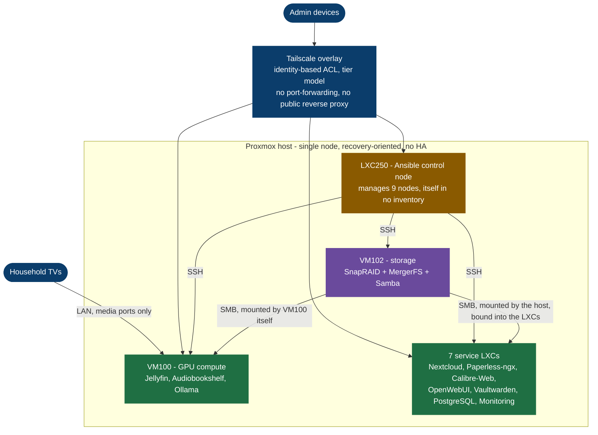

# Homelab Platform Architecture

   

        

A single-host Proxmox platform: ten guests, Zero-Trust access over Tailscale, nine of eleven nodes
managed by Ansible - and a written record of the two that are not.

Built and operated by Nicolas Pogorzelski. Claims here are checked against the running system, and
the repository carries an [ISO/IEC 27001 Annex A self-assessment](docs/platform/security-controls.md)
- a mapping against the control catalogue, not a compliance claim - a
[root-caused incident register](docs/platform/known-errors.md) and a
[ranked plan of what is still open](docs/platform/remediation-plan.md).

## At a glance

Every arrow follows what is delivered - a request to the service it reaches, storage to the node
that mounts it, configuration to the node it configures. The same rule holds across all the detailed
views. Worth reading for what is missing: no configuration arrow points into LXC250. It configures
the nine other nodes and belongs to no inventory group itself.

Four detailed views follow from here: the [logical architecture](docs/architecture/diagram.md) -
access policy by Tailscale tag, the three storage layers, and monitoring coverage by exporter class
- plus [failure domains](docs/architecture/failure-domains.md),
[backup and recovery](docs/architecture/backup-flow.md) and the
[exposure model](docs/architecture/exposure-diagram.md).

| Layer | Component | Purpose |
|---|---|---|
| Hypervisor | Proxmox | Virtualization platform |
| Storage | SnapRAID + MergerFS | Parity protection + flexible expansion |
| Compute | Docker on VM100 | GPU-enabled workloads |
| Services | Unprivileged LXCs | Isolation and segmentation |
| Configuration | Ansible | Declarative management of every guest; roles, inventory, vault |
| Access | Tailscale | Identity-based remote access (Zero Trust) |
| Monitoring | Prometheus + Grafana | Observability layer |

High availability is not implemented, and not intended. A single host cannot fail over, so the
effort goes into deterministic recovery: explicit dependency modelling, documented failure
procedures, and a runbook for each of them.

---

## Why this exists

A deliberate learning environment for a career transition into DevOps and platform engineering. It
holds live data with defined recovery objectives, classified per dataset in
[data classification](docs/platform/data-classification.md). Incidents are documented, post-mortems
written, and every failure turned into a runbook or a known-error entry.

The emphasis throughout is on cost-aware, risk-conscious engineering. Every component here has a
stated reason for being present, the trust boundaries between them are defined in the ACL, and the
trade-offs behind both are written down in the design decisions.

---

## How to read this repository

Three entry points, depending on what you came for. Each is one document that links onward.

| If you want to see | Start at |
|---|---|
| How it is built and why the trade-offs went the way they did | [Design Decisions](docs/decisions/design-decisions.md), then the [architecture diagram](docs/architecture/diagram.md) |
| How it is run, and what has broken | [Known Errors](docs/platform/known-errors.md) and the [Platform Changelog](docs/platform/changelog.md) |
| How it is secured, and where it is not | [Security Controls](docs/platform/security-controls.md) and [Data Classification](docs/platform/data-classification.md) |

The single best illustration of how decisions are made here is
[SMB bind and LAN access](docs/decisions/smb-bind-and-lan-access.md): a rule the platform sets for
itself, a service that cannot follow it, three attempts measured and rejected, and the boundary
moved one layer down instead - with the reboot that proves it.

---

## Documentation standard

Any statement here that carries a number was measured against the running system rather than
estimated, and the command that produced it is usually quoted alongside. Where a claim later turned
out to be wrong, it is corrected in place with the correction visible, not silently overwritten -
the [changelog](docs/platform/changelog.md) and the [known-error
register](docs/platform/known-errors.md) carry more corrections than announcements, on purpose.

Runbooks that have been executed record the date and the result in the document itself. Most have
not been run against a real incident, and saying so is more useful than a claim the files do not
support. This paragraph asserted that every runbook carried such a record until an audit on
2026-08-17 checked it, and carried a count of its own until that count drifted too.

---

## Learning Roadmap

| Phase | Topic | Status |
|---|---|---|
| 1 | Linux, Bash, Git, Networking | Done |
| 2 | Docker + Compose | Done |
| 3 | Monitoring - Prometheus, Grafana, Alertmanager | Done |
| 4 | Zero Trust Networking - Tailscale, ACL design | Done |
| 5 | Ansible - playbooks, roles, vault, hardening | Done |
| 6 | Terraform - IaC on AWS (free tier) + Proxmox provisioning | Planned |
| 7 | Kubernetes - k3s in the homelab | Planned |
| 8 | Cloud depth (AWS) + Python | Planned |

Bash scripting runs cross-cutting throughout; Disaster Recovery and Security are practiced continuously rather than as a single phase. Targeted certifications: Terraform Associate, then AWS Solutions Architect Associate.

What is currently open, ranked by what its loss would cost, is in the
[remediation plan](docs/platform/remediation-plan.md).

---

## Documentation

### Architecture

- [Architecture Overview](docs/architecture/overview.md)
- [Logical Architecture Diagram](docs/architecture/diagram.md) (Mermaid - access policy, storage, monitoring coverage)
- [Failure Domains](docs/architecture/failure-domains.md) (Mermaid - what dies with which disk)
- [Backup and Recovery Flow](docs/architecture/backup-flow.md) (Mermaid - what is copied, and what is not)
- [Exposure Model Diagram](docs/architecture/exposure-diagram.md) (Mermaid)

### Decisions

- [Design Decisions](docs/decisions/design-decisions.md) (trade-offs and rationale)
- [SMB Bind and LAN Access](docs/decisions/smb-bind-and-lan-access.md) (a rule the service cannot follow, enforced one layer down)
- [Loopback + Tailscale Serve](docs/decisions/loopback-tailscale-serve.md) (binding pattern ADR)
- [Calibre Auto-Import on CIFS](docs/decisions/calibre-cifs-sqlite-import.md) (SQLite byte-range locking over SMB)
- [PostgreSQL Tailscale Boot Ordering](docs/decisions/postgresql-tailscale-boot-ordering.md) (ordering is not readiness)
- [pveproxy Tailscale Boot Ordering](docs/decisions/pveproxy-tailscale-boot-ordering.md) (the same race on the hypervisor)
- [LXC250 DevOps Workstation](docs/decisions/lxc250-devops.md) (central management node ADR)
- [Headscale Migration](docs/decisions/headscale-migration.md) (control plane sovereignty - deferred to Phase 6)

### Security, risk and change

- [Security Controls](docs/platform/security-controls.md) (ISO/IEC 27001 Annex A mapping - what is enforced, what is merely practised)
- [Data Classification](docs/platform/data-classification.md) (classification, recovery objectives, data protection assessment)
- [Remediation Plan](docs/platform/remediation-plan.md) (open work ordered by loss risk and dependency)
- [Known Errors](docs/platform/known-errors.md) (the corrective-action log, 20 entries with root causes)
- [Platform Changelog](docs/platform/changelog.md) (every change with the measurement that verified it)

### Platform

- [Storage Design](docs/platform/storage-design.md) (SnapRAID + MergerFS)
- [Samba](docs/platform/samba.md) (segmented exports, least privilege)
- [Monitoring](docs/platform/monitoring.md) (Prometheus + Grafana stack)
- [Networking](docs/platform/networking.md) (Zero-Trust model)
- [Tailscale ACL](docs/platform/tailscale-acl.md) (policy-as-code, tier model)
- [Ansible](docs/platform/ansible.md) (control node, inventory, vault, roles)
- [Proxmox Host](docs/platform/proxmox-host.md) (hypervisor-level config, boot ordering, power schedule)
- [Storage Permissions](docs/platform/storage-permissions.md) (the filesystem side of the share model, verified daily)
- [Operations](docs/platform/operations.md) (operational model, dependency layers, incident playbooks)

### Incidents

- [aux-disk failure and recovery](docs/platform/incidents/2026-06-25-aux-disk-failure-and-recovery.md) (2026-06-25)
- [VM100 silent freeze](docs/platform/incidents/2026-07-11-vm100-silent-freeze.md) (2026-07-11)

### Automation

Everything guest-side is Ansible-managed, and every scheduled job is a systemd timer with
`Persistent=true` - the host powers down overnight, so cron silently loses every slot it sleeps
through.

- [Ansible Platform Doc](docs/platform/ansible.md) - control node, inventory, vault, and the full
  catalogue of playbooks and roles
- [Playbooks](ansible/playbooks/) and [Roles](ansible/roles/) - 28 and 24 respectively
- [Ansible Inventory](ansible/inventory/hosts.yml.example) (sanitized - real IPs gitignored)
- [Repository validator](scripts/validate-repo.sh) - 25 structural checks, run by a pre-commit
  hook and by CI on every push

### Runbooks

Fourteen procedures under the same contract: every one states its preconditions, its verification
step, its failure modes and its rollback - or records that no rollback exists and why, which for
`snapraid sync` is the whole point. Enforced by the validator, not by habit.

All fourteen runbooks

- [Runbook Index](runbooks/README.md)
- Database: [PostgreSQL backup](runbooks/database/pg-backup.md) - [PostgreSQL restore](runbooks/database/pg-restore.md) - [MariaDB backup](runbooks/database/mariadb-backup.md)
- Storage: [SnapRAID sync](runbooks/storage/snapraid-sync.md) - [SnapRAID scrub](runbooks/storage/snapraid-scrub.md) - [aux-disk failure rescue](runbooks/storage/aux-disk-failure-rescue.md) - [SMB automount trigger](runbooks/storage/smb-autofs-trigger.md)
- Platform: [hard shutdown recovery](runbooks/platform/hard-shutdown-recovery.md) - [LVM thin pool full](runbooks/platform/lvm-thin-pool-full.md) - [LXC250 rebuild](runbooks/platform/lxc250-rebuild.md) - [pveproxy boot race](runbooks/platform/pveproxy-tailscale-boot-race.md) - [Docker data-root migration](runbooks/platform/docker-data-root-migration.md)
- Services: [OpenWebUI health](runbooks/ai-stack/openwebui-health.md) - [Nextcloud/Paperless integration](runbooks/integration/nextcloud-paperless.md)

### Nodes

Ten guests, one document each

- [VM100 - GPU / Compute](docs/nodes/vm100.md) (Docker, NVIDIA, Jellyfin, Audiobookshelf)
- [VM102 - Storage](docs/nodes/vm102.md) (SnapRAID, MergerFS, Samba)
- [LXC200 - Monitoring](docs/nodes/lxc200.md) (Prometheus, Grafana, Node Exporter)
- [LXC210 - Nextcloud](docs/nodes/lxc210.md) (Apache, PHP, MariaDB, Redis)
- [LXC211 - Paperless-ngx](docs/nodes/lxc211.md) (Docker in LXC, document management)
- [LXC220 - Calibre-Web](docs/nodes/lxc220.md) (Docker in LXC)
- [LXC230 - OpenWebUI](docs/nodes/lxc230.md) (AI stack, Docker in LXC)
- [LXC240 - Vaultwarden](docs/nodes/lxc240.md) (Docker in LXC, secrets tier)
- [LXC250 - DevOps](docs/nodes/lxc250.md) (Git, Ansible, IaC)
- [LXC260 - PostgreSQL](docs/nodes/lxc260.md) (centralized platform database)

### Services

Nine service documents, each with its access model

- [Jellyfin](docs/services/jellyfin.md)
- [Audiobookshelf](docs/services/audiobookshelf.md)
- [Nextcloud](docs/services/nextcloud.md)
- [Paperless-ngx](docs/services/paperless.md)
- [Calibre-Web](docs/services/calibre-web.md)
- [OpenWebUI](docs/services/openwebui.md)
- [Ollama](docs/services/ollama.md)
- [Vaultwarden](docs/services/vaultwarden.md)
- [PostgreSQL Platform](docs/services/postgresql-platform.md)

