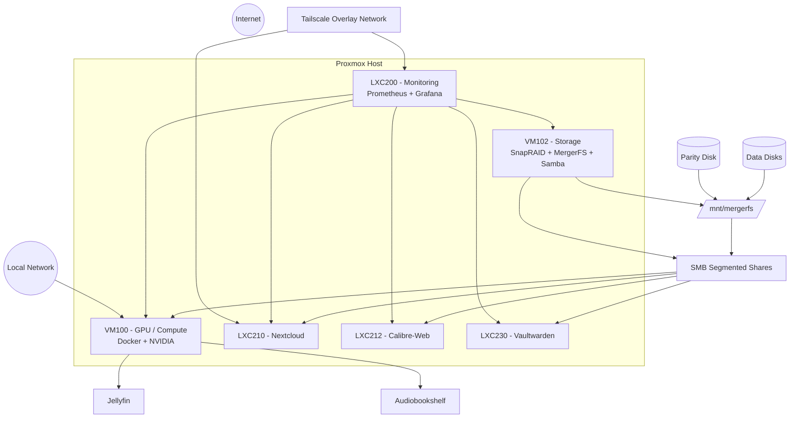

# Infrastructure Architecture – Logical View

This diagram represents the logical separation of layers and service dependencies.

```mermaid
flowchart TB

    %% External Layers
    Internet((Internet))
    LAN((Local Network))
    TS[Tailscale Overlay Network]

    %% Hypervisor
    subgraph Proxmox Host
        VM102[VM102 - Storage<br/>SnapRAID + MergerFS + Samba]
        VM100[VM100 - GPU / Compute<br/>Docker + NVIDIA]
        LXC200[LXC200 - Monitoring<br/>Prometheus + Grafana]
        LXC210[LXC210 - Nextcloud]
        LXC212[LXC212 - Calibre-Web]
        LXC230[LXC230 - Vaultwarden]
    end

    %% Storage
    Disks[(Data Disks)]
    Parity[(Parity Disk)]
    MergerFS[/mnt/mergerfs/]
    Samba[SMB Segmented Shares]

    Disks --> MergerFS
    Parity --> MergerFS
    MergerFS --> Samba
    VM102 --> MergerFS
    VM102 --> Samba

    %% Compute Layer
    Samba --> VM100
    Samba --> LXC210
    Samba --> LXC212
    Samba --> LXC230

    %% Docker Services
    VM100 --> Jellyfin[Jellyfin]
    VM100 --> ABS[Audiobookshelf]

    %% Monitoring
    LXC200 --> VM102
    LXC200 --> VM100
    LXC200 --> LXC210
    LXC200 --> LXC212
    LXC200 --> LXC230

    %% Network Exposure
    LAN --> VM100
    TS --> LXC210
    TS --> LXC200
```
