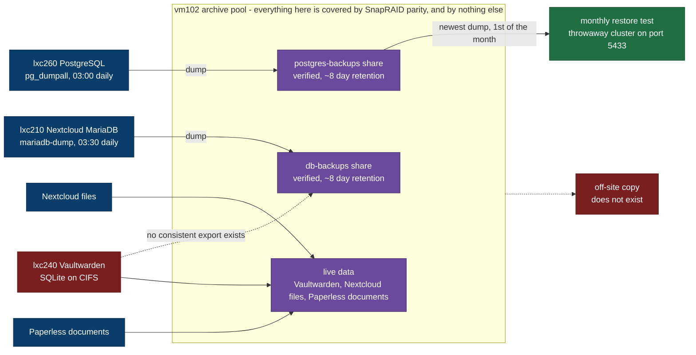

# Backup and Recovery Flow

What is copied, to where, how often, and - drawn as deliberately as the rest - what is not copied at
all. The arrows follow the payload, as everywhere else on this site: a dump moves from the database
that produced it to the share that stores it.

Red is not decoration here. It marks the two ends of this picture that do not exist yet, both of
them open items in [Tier 1 of the remediation plan](../platform/remediation-plan.md).

## What the picture is saying

**Two database chains are complete and verified.** Both dumps are written to a `.partial` name and
renamed only after three checks pass - non-empty, `gzip -t`, and exactly one completion marker - and
the verification runs *before* the retention delete, so a failed run can never remove the last
healthy predecessor. Only the marker check catches the case that matters: a dump killed halfway
still produces a valid gzip member, which restores without error into empty tables.

**One chain is validated end to end.** The PostgreSQL dump is restored into a throwaway cluster on
port 5433 on the first of each month, asserting dump integrity, restore success and non-empty key
tables. The MariaDB chain has a documented restore procedure but no scheduled test yet.

**One source has no export at all.** Vaultwarden holds every household credential and stores them in
an SQLite file on a CIFS mount. Copying that file while the service runs is a bet on timing, not a
backup, which is why the arrow to the share is dotted. Its data reaches the pool only as live files,
protected by parity. That is the last open half of Tier 1 item 3.

**Nothing leaves the site.** Every arrow above ends inside the flat. The archive pool holds the
backups and the primary data of three services, so a fire, a theft or an encryption event takes the
originals and the copies in one move. The only dataset with a genuine off-site copy is this
repository, because it is on GitHub and on two workstations.

## Parity is not backup, and this is where that bites

SnapRAID reconstructs a disk. It does not reconstruct a file that was deleted, truncated or
encrypted before the next `snapraid sync`, because that sync writes the damage into the parity.
Every dotted parity arrow above therefore protects against exactly one failure mode out of four.

[KE-19](../platform/known-errors.md#ke-19) sharpened this once already: `db.sqlite3-shm` and `-wal`
sat in the array next to the main Vaultwarden database, so parity captured the three files at
different moments - an inconsistent set from which a reconstruction can be corrupt. The side files
are excluded now. `db.sqlite3` itself deliberately stays in, because imperfect protection beats none
until the export exists.

## The guards, and the blind spot they share

| Alert | Fires when | Blind to |
|---|---|---|
| `PostgreSQLBackupStale` | no dump newer than 25 h | an outage in which the host is off |
| `MariaDBBackupStale` | same rule, lxc210's metric | the same |
| `PostgreSQLRestoreTestStale` | no successful restore test for 40 days | - |

The first two share a failure domain with what they guard. Prometheus runs on the host that powers
down every night, so during a multi-day outage there is no scrape at all, and by the time Prometheus
returns, the timer's `Persistent=true` catch-up has already written a fresh dump and refreshed the
timestamp. Measured on 2026-08-14: a 62-hour scrape gap with no dump written in it and the alert
empty across the whole range. The rule means "not more than 25 hours of uptime without a backup".

This is left as it is on purpose - on a host that sleeps by design, an alert for "the host was off"
is noise - and the structural answer is the external heartbeat in the plan's Tier 4, not a different
threshold.

## Related

- [Failure domains](failure-domains.md) - which disk takes which of these datasets with it
- [Data classification](../platform/data-classification.md) - class and recovery objective per dataset
- [PostgreSQL backup](../../runbooks/database/pg-backup.md), [restore](../../runbooks/database/pg-restore.md), [MariaDB backup](../../runbooks/database/mariadb-backup.md) - the procedures themselves
