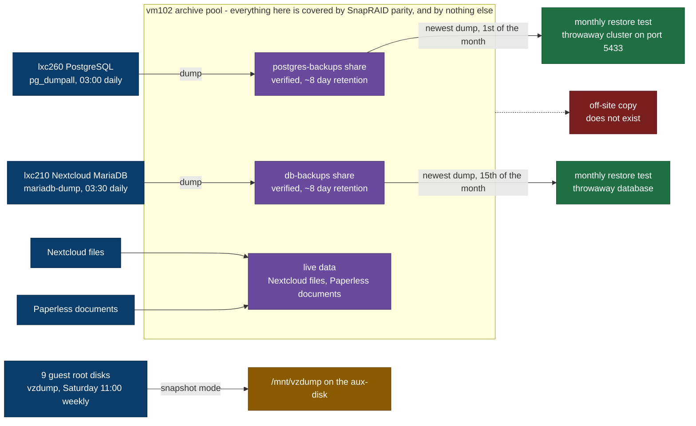

# Backup and Recovery Flow

What is copied, to where, how often, and - drawn as deliberately as the rest - what is not copied at
all. The arrows follow the payload, as everywhere else on this site: a dump moves from the database
that produced it to the share that stores it.

Red is not decoration here. It marks the one end of this picture that does not exist yet, the
off-site copy, an open item in [Tier 1 of the remediation plan](../platform/remediation-plan.md).
Orange marks a copy that exists but sits on the failing aux-disk
([KE-13](../platform/known-errors.md#ke-13)).

```mermaid
flowchart LR
  accTitle: Backup flows and the gaps in them
  accDescr: PostgreSQL and MariaDB dumps to SMB shares on vm102 protected by parity, each with a monthly restore test, weekly guest backups onto the aux-disk, and the missing off-site copy marked as a gap.

  PG["lxc260 PostgreSQL<br/>pg_dumpall, 03:00 daily"]
  MDB["lxc210 Nextcloud MariaDB<br/>mariadb-dump, 03:30 daily"]
  GUESTS["9 guest root disks<br/>vzdump, Saturday 11:00 weekly"]
  NCF["Nextcloud files"]
  PPD["Paperless documents"]

  subgraph vm102["vm102 archive pool - everything here is covered by SnapRAID parity, and by nothing else"]
    PGSHARE["postgres-backups share<br/>verified, ~8 day retention"]
    DBSHARE["db-backups share<br/>verified, ~8 day retention"]
    LIVE["live data<br/>Nextcloud files, Paperless documents"]
  end

  VZDUMP["/mnt/vzdump on the aux-disk"]
  RESTORE["monthly restore test<br/>throwaway cluster on port 5433"]
  MRESTORE["monthly restore test<br/>throwaway database"]
  OFFSITE["off-site copy<br/>does not exist"]

  PG -->|"dump"| PGSHARE
  MDB -->|"dump"| DBSHARE
  NCF --> LIVE
  PPD --> LIVE
  GUESTS -->|"snapshot mode"| VZDUMP

  PGSHARE -->|"newest dump, 1st of the month"| RESTORE
  DBSHARE -->|"newest dump, 15th of the month"| MRESTORE
  vm102 -.-> OFFSITE

  classDef src fill:#0b3d6b,stroke:#062a4b,color:#ffffff
  classDef store fill:#6a4a9c,stroke:#4c3570,color:#ffffff
  classDef ok fill:#1f6f43,stroke:#14512f,color:#ffffff
  classDef warn fill:#8a5a00,stroke:#5f3e00,color:#ffffff
  classDef gap fill:#7a1f1f,stroke:#571414,color:#ffffff
  class PG,MDB,NCF,PPD,GUESTS src
  class PGSHARE,DBSHARE,LIVE store
  class RESTORE,MRESTORE ok
  class VZDUMP warn
  class OFFSITE gap
```

## What the picture is saying

**Two database chains are complete and verified.** Both dumps are written to a `.partial` name and
renamed only after three checks pass - non-empty, `gzip -t`, and exactly one completion marker - and
the verification runs *before* the retention delete, so a failed run can never remove the last
healthy predecessor. Only the marker check catches the case that matters: a dump killed halfway
still produces a valid gzip member, which restores without error into empty tables.

**Both chains are validated end to end.** The PostgreSQL dump is restored into a throwaway cluster
on port 5433 on the first of each month, asserting dump integrity, restore success and non-empty key
tables. The MariaDB dump is restored into a throwaway database on the fifteenth, first passed on
2026-09-17; the live database is not touched by either.

**The guest backup shares a disk with what it would rebuild.** `guest_backup` writes a weekly
`vzdump` of nine guests (vm100 excluded on purpose) to `/mnt/vzdump`, which is bound onto the
aux-disk. A restore was verified on 2026-08-21. See the
[guest backup runbook](../../runbooks/platform/guest-backup-restore.md).

Vaultwarden is no longer drawn. It was withdrawn on 2026-09-01 and its container destroyed on
2026-09-29; its data stays on the pool, under parity only, until phase 2 of the
[decommissioning decision](../decisions/vaultwarden-decommission.md) removes it.

**No running job copies anything off site.** Every arrow above ends inside the flat. The archive
pool holds the backups and the primary data of two services, so a fire, a theft or an encryption
event takes the originals and the copies in one move. What exists elsewhere is point in time: this
repository on GitHub and two workstations, the escrowed secrets, and two irregular disk copies listed
in [data classification](../platform/data-classification.md), none of which covers the archive
pool.

## Parity is not backup, and this is where that bites

SnapRAID reconstructs a disk. It does not reconstruct a file that was deleted, truncated or
encrypted before the next `snapraid sync`, because that sync writes the damage into the parity.
Every dotted parity arrow above therefore protects against exactly one failure mode out of four.

[KE-19](../platform/known-errors.md#ke-19) sharpened this once already: `db.sqlite3-shm` and `-wal`
sat in the array next to the main Vaultwarden database, so parity captured the three files at
different moments - an inconsistent set from which a reconstruction can be corrupt. The side files
are excluded now. `db.sqlite3` itself stays in until the data is removed, the service being stopped
and the file therefore no longer changing.

## The guards, and the blind spot they share

| Alert | Fires when | Blind to |
|---|---|---|
| `PostgreSQLBackupStale` | no dump newer than 25 h | an outage in which the host is off |
| `MariaDBBackupStale` | same rule, lxc210's metric | the same |
| `PostgreSQLRestoreTestStale` | no successful restore test for 40 days | - |
| `MariaDBRestoreTestStale` | the same, for the MariaDB chain | - |
| `DatabaseBackupMetricsMissing` | a backup or restore-test timestamp is absent, when its staleness rule is silent | - |
| `GuestBackupStale` | last guest backup run older than 10 days | - |
| `GuestBackupPartial` | at least one guest failed in the last run | - |

The first two share a failure domain with what they guard. Prometheus runs on the host that powers
down every night, so during a multi-day outage there is no scrape at all, and by the time Prometheus
returns, the timer's `Persistent=true` catch-up has already written a fresh dump and refreshed the
timestamp. Measured on 2026-08-14: a 62-hour scrape gap with no dump written in it and the alert
empty across the whole range. The rule means "not more than 25 hours of uptime without a backup".

This is left as it is on purpose - on a host that sleeps by design, an alert for "the host was off"
is noise - and the structural answer is the external heartbeat in the plan's Tier 4, not a different
threshold.

## Related

- [Failure domains](failure-domains.md) - which disk takes which of these datasets with it
- [Data classification](../platform/data-classification.md) - class and recovery objective per dataset
- [PostgreSQL backup](../../runbooks/database/pg-backup.md), [restore](../../runbooks/database/pg-restore.md), [MariaDB backup](../../runbooks/database/mariadb-backup.md) - the procedures themselves
