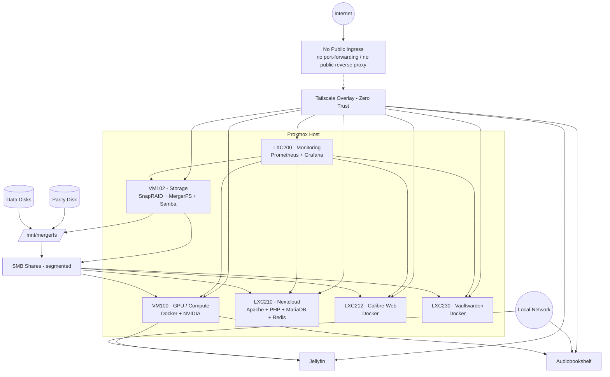

# Infrastructure Architecture – Logical View

This diagram shows the logical separation of layers, storage dependencies, and the access model:

- Remote access: Tailscale overlay for all services
- LAN access: only media services on VM100 (performance trade-off)
- No public ingress: no router port-forwarding / no public reverse proxy

Note: Network policy is enforced via Tailscale ACL (tags + ACL JSON). See: [docs/platform/tailscale-acl.md](../platform/tailscale-acl.md)
