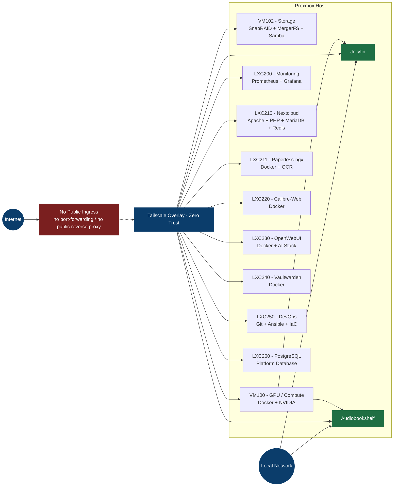
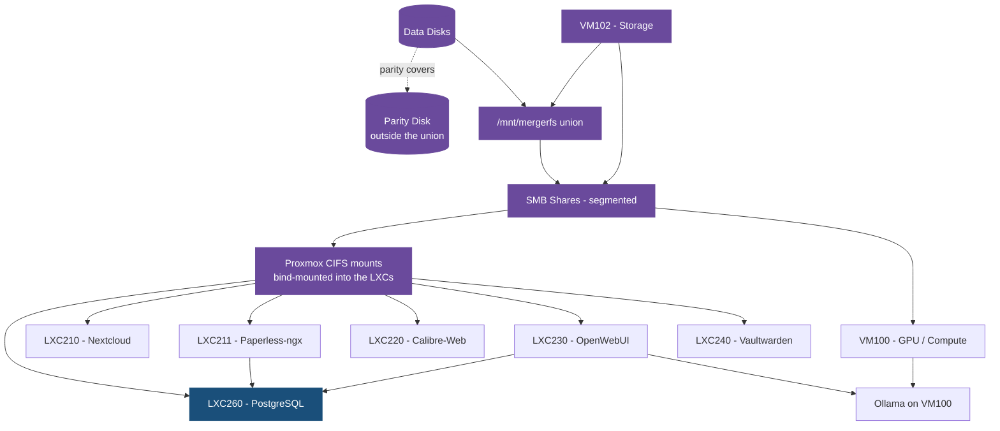
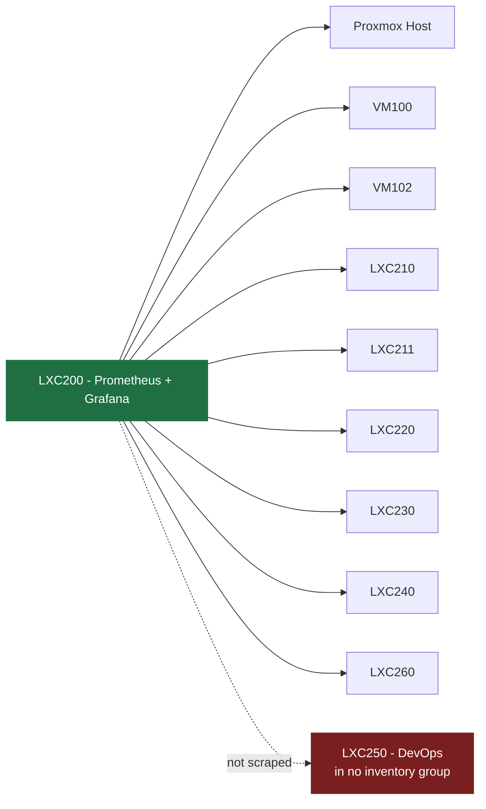

# Infrastructure Architecture - Logical View

This page shows the platform in three views rather than one. A single graph carried access paths,
storage dependencies and monitoring coverage at the same time, which made every individual path hard
to follow. The three below hold the same relationships, separated by the question they answer.

- Remote access: Tailscale overlay for all services
- LAN access: only media services on VM100 (performance trade-off)
- No public ingress: no router port-forwarding / no public reverse proxy. Note the qualification
  in [the exposure model](exposure-diagram.md): several services bind wildcard addresses on nodes
  that carry a routable IPv6, so what prevents reachability is the router, not the binding.

**Reading the arrows:** a solid arrow is a path that carries traffic or a dependency that must hold
for the target to work. A dotted arrow is a relationship that is not a data path - parity coverage,
or an ingress that is deliberately absent.

## View 1 - Access paths

Who reaches what, and over which network. Every guest is reachable over the overlay; only the two
media services are additionally reachable from the LAN.

```mermaid
flowchart LR

  Internet((Internet))
  LAN((Local Network))
  TS[Tailscale Overlay - Zero Trust]
  NoPublic[No Public Ingress<br/>no port-forwarding / no public reverse proxy]

  Internet --> NoPublic
  NoPublic -.-> TS

  subgraph host[Proxmox Host]
    VM102[VM102 - Storage<br/>SnapRAID + MergerFS + Samba]
    VM100[VM100 - GPU / Compute<br/>Docker + NVIDIA]
    LXC200[LXC200 - Monitoring<br/>Prometheus + Grafana]
    LXC210[LXC210 - Nextcloud<br/>Apache + PHP + MariaDB + Redis]
    LXC211[LXC211 - Paperless-ngx<br/>Docker + OCR]
    LXC220[LXC220 - Calibre-Web<br/>Docker]
    LXC230[LXC230 - OpenWebUI<br/>Docker + AI Stack]
    LXC240[LXC240 - Vaultwarden<br/>Docker]
    LXC250[LXC250 - DevOps<br/>Git + Ansible + IaC]
    LXC260[LXC260 - PostgreSQL<br/>Platform Database]
    Jellyfin[Jellyfin]
    ABS[Audiobookshelf]
  end

  VM100 --> Jellyfin
  VM100 --> ABS

  TS --> VM100
  TS --> VM102
  TS --> LXC200
  TS --> LXC210
  TS --> LXC211
  TS --> LXC220
  TS --> LXC230
  TS --> LXC240
  TS --> LXC250
  TS --> LXC260

  TS --> Jellyfin
  TS --> ABS
  LAN --> Jellyfin
  LAN --> ABS

  classDef access fill:#0b3d6b,stroke:#0b3d6b,color:#ffffff
  classDef blocked fill:#7a1f1f,stroke:#7a1f1f,color:#ffffff
  classDef media fill:#1f6f43,stroke:#1f6f43,color:#ffffff
  class Internet,LAN,TS access
  class NoPublic blocked
  class Jellyfin,ABS media
```

## View 2 - Storage and data dependencies

Where the bytes live, and which service stops working when a layer below it does. Note the
asymmetry: VM100 mounts CIFS itself, while the LXCs never do - the Proxmox host mounts the shares
and bind-mounts them into the containers, which is why a failed host mount surfaces inside a
container as an empty directory ([KE-15](../platform/known-errors.md#ke-15)).

```mermaid
flowchart TB

  Disks[(Data Disks)]
  Parity[(Parity Disk<br/>outside the union)]
  MergerFS["/mnt/mergerfs union"]
  Samba[SMB Shares - segmented]
  HostCIFS[Proxmox CIFS mounts<br/>bind-mounted into the LXCs]
  VM102[VM102 - Storage]

  Disks --> MergerFS
  Disks -.parity covers.-> Parity
  VM102 --> MergerFS
  MergerFS --> Samba
  VM102 --> Samba

  Samba --> VM100[VM100 - GPU / Compute]
  Samba --> HostCIFS

  HostCIFS --> LXC210[LXC210 - Nextcloud]
  HostCIFS --> LXC211[LXC211 - Paperless-ngx]
  HostCIFS --> LXC220[LXC220 - Calibre-Web]
  HostCIFS --> LXC230[LXC230 - OpenWebUI]
  HostCIFS --> LXC240[LXC240 - Vaultwarden]
  HostCIFS --> LXC260[LXC260 - PostgreSQL]

  LXC211 --> LXC260
  LXC230 --> LXC260
  LXC230 --> Ollama[Ollama on VM100]
  VM100 --> Ollama

  classDef storage fill:#6a4a9c,stroke:#6a4a9c,color:#ffffff
  classDef db fill:#1a4f7a,stroke:#1a4f7a,color:#ffffff
  class Disks,Parity,MergerFS,Samba,HostCIFS,VM102 storage
  class LXC260 db
```

## View 3 - Monitoring coverage

What LXC200 scrapes, and what it does not. LXC250 is drawn as an explicit gap rather than left out:
it belongs to no inventory group, so it appears in no scrape config, and a diagram that simply
omitted it would show a complete picture the platform does not have. Tracked in the
[remediation plan](../platform/remediation-plan.md).

```mermaid
flowchart LR

  LXC200[LXC200 - Prometheus + Grafana]

  LXC200 --> Host[Proxmox Host]
  LXC200 --> VM100[VM100]
  LXC200 --> VM102[VM102]
  LXC200 --> LXC210[LXC210]
  LXC200 --> LXC211[LXC211]
  LXC200 --> LXC220[LXC220]
  LXC200 --> LXC230[LXC230]
  LXC200 --> LXC240[LXC240]
  LXC200 --> LXC260[LXC260]

  LXC200 -.not scraped.-> LXC250[LXC250 - DevOps<br/>in no inventory group]

  classDef mon fill:#1f6f43,stroke:#1f6f43,color:#ffffff
  classDef gap fill:#7a1f1f,stroke:#7a1f1f,color:#ffffff
  class LXC200 mon
  class LXC250 gap
```

Note: Network policy is enforced via Tailscale ACL (tags + ACL JSON). See: [docs/platform/tailscale-acl.md](../platform/tailscale-acl.md)
