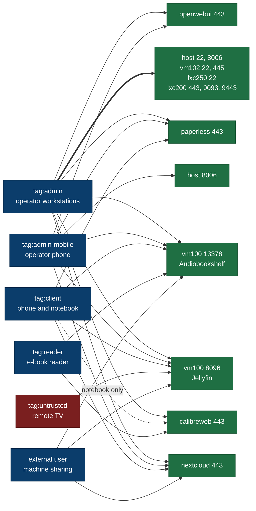
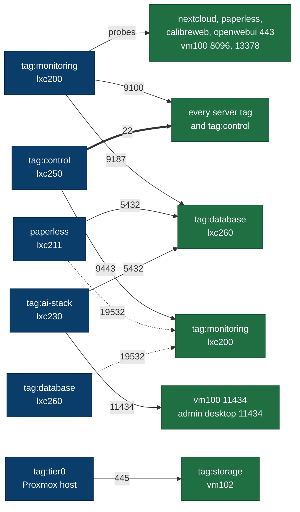
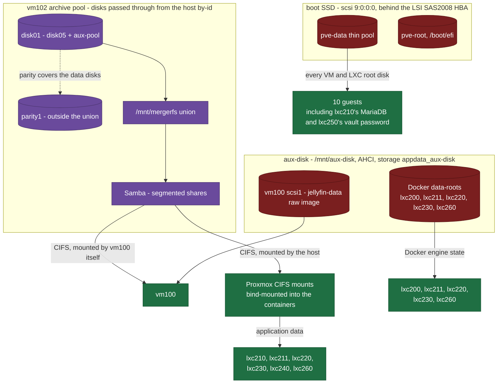
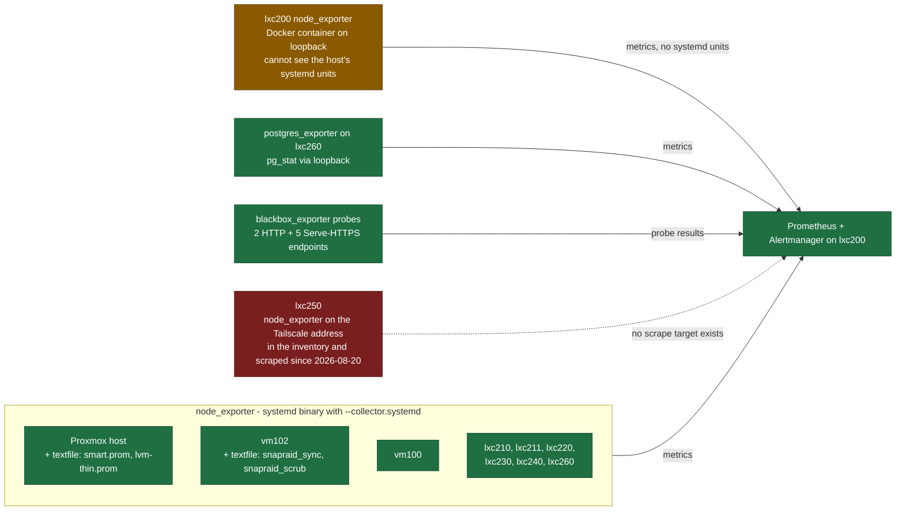

# Infrastructure Architecture - Logical View

Three views, each answering one question: who may talk to whom, where the bytes live, and what is
watched. Two further views live in their own documents because they answer questions about failure
rather than about structure - [failure domains](failure-domains.md) and
[backup and recovery](backup-flow.md).

## Reading the arrows

**An arrow follows what is delivered.** A request to the service it reaches, bytes to the node that
consumes them, metrics to the collector, configuration to the node it configures. Where the network
connection is opened in the opposite direction, the view says so on the spot - View 3 is the case
that matters, because Prometheus pulls.

A dotted arrow marks a relationship that delivers nothing: parity protection, or a path that is
deliberately absent.

**Containment means "runs inside".** Where a component runs within another, it is drawn inside its
box rather than attached by an arrow, so that no arrow has to mean "is part of" as well.

Node identifiers match the inventory (`vm100`, `lxc210`), so a node in a diagram can be grepped for
in `ansible/inventory/` and in `docs/nodes/`.

---

## View 1 - Access policy

Not a node list - the policy itself. Every arrow is an ACL rule from
[`tailscale-acl.md`](../platform/tailscale-acl.md) with the ports it grants. Here the delivery
direction and the connection direction are the same: the arrow is the request.

Since the rebuild of 2026-09-26 most grants name a host rather than a tag, because `tag:tier1` holds
three services and reaching one of them should not mean reaching the other two. The diagram draws
them the same way: a service box stands for one host, a tag box for every node carrying the tag.

An ACL is a relation between sources and destinations, so it is drawn as one: sources on the left,
destinations on the right, ports on the edge. It is split in two because the policy answers two
different questions - what a person or device may reach, and what a service may reach on its own
behalf.

### 1a - Access by people and devices

```mermaid
flowchart LR
  accTitle: Tailscale ACL - access granted to people's devices
  accDescr: Operator workstations, operator phone, end-user devices, e-book reader, a remote TV and an external user through machine sharing, each with the services and ports it may reach.

  ADMIN_S["tag:admin<br/>operator workstations"]
  MOBILE_S["tag:admin-mobile<br/>operator phone"]
  CLIENT_S["tag:client<br/>phone and notebook"]
  READER_S["tag:reader<br/>e-book reader"]
  UNTRUST_S["tag:untrusted<br/>remote TV"]
  EXTERNAL_S["external user<br/>machine sharing"]

  INFRA["host 22, 8006<br/>vm102 22, 445<br/>lxc250 22<br/>lxc200 443, 9093, 9443"]
  PVE["host 8006"]
  NC["nextcloud 443"]
  PL["paperless 443"]
  CW["calibreweb 443"]
  OW["openwebui 443"]
  JF["vm100 8096<br/>Jellyfin"]
  ABS["vm100 13378<br/>Audiobookshelf"]

  ADMIN_S ==> INFRA
  ADMIN_S --> NC & PL & CW & OW & JF & ABS
  MOBILE_S --> PVE & NC & PL & OW & JF & ABS
  CLIENT_S --> NC & PL & JF & ABS
  CLIENT_S -.->|"notebook only"| CW
  READER_S --> CW & ABS
  UNTRUST_S --> JF
  EXTERNAL_S --> NC & JF & ABS

  classDef src fill:#0b3d6b,stroke:#062a4b,color:#ffffff
  classDef dst fill:#1f6f43,stroke:#14512f,color:#ffffff
  classDef untrust fill:#7a1f1f,stroke:#571414,color:#ffffff
  class ADMIN_S,MOBILE_S,CLIENT_S,READER_S,EXTERNAL_S src
  class INFRA,PVE,NC,PL,CW,OW,JF,ABS dst
  class UNTRUST_S untrust
```

The dotted arrow is a real grant with a narrower source: the rule names the client notebook's
address, not the tag. Two tags are missing on purpose. `tag:isolated` has no rule at all, and no rule
anywhere has a person's device as its destination, apart from Ollama on the admin desktop in 1b.

### 1b - Service to service, and monitoring

```mermaid
flowchart LR
  accTitle: Tailscale ACL - service-to-service, control and monitoring rules
  accDescr: The monitoring node, the control node, the hypervisor, Paperless and the AI stack on the left, with the ports they may reach.

  MON_S["tag:monitoring<br/>lxc200"]
  CTL_S["tag:control<br/>lxc250"]
  T0_S["tag:tier0<br/>Proxmox host"]
  PL_S["paperless<br/>lxc211"]
  DB_S["tag:database<br/>lxc260"]
  AI_S["tag:ai-stack<br/>lxc230"]

  SERVERS["every server tag<br/>and tag:control"]
  PROBES["nextcloud, paperless,<br/>calibreweb, openwebui 443<br/>vm100 8096, 13378"]
  ST_D["tag:storage<br/>vm102"]
  DB_D["tag:database<br/>lxc260"]
  MON_D["tag:monitoring<br/>lxc200"]
  OLL["vm100 11434<br/>admin desktop 11434"]

  MON_S -->|"9100"| SERVERS
  MON_S -->|"9187"| DB_D
  MON_S -->|"probes"| PROBES
  CTL_S ==>|"22"| SERVERS
  CTL_S -->|"9443"| MON_D
  T0_S -->|"445"| ST_D
  PL_S -->|"5432"| DB_D
  PL_S -.->|"19532"| MON_D
  DB_S -.->|"19532"| MON_D
  AI_S -->|"5432"| DB_D
  AI_S -->|"11434"| OLL

  classDef src fill:#0b3d6b,stroke:#062a4b,color:#ffffff
  classDef dst fill:#1f6f43,stroke:#14512f,color:#ffffff
  class MON_S,CTL_S,T0_S,PL_S,DB_S,AI_S src
  class SERVERS,PROBES,ST_D,DB_D,MON_D,OLL dst
```

The dotted arrows are the journal upload, an exercise rather than a path the platform depends on.
Two tags never appear as a source: `tag:storage` and `tag:tier2`. vm102 and vm100 answer and never
initiate over the tailnet - vm100 mounts its media over the LAN - and since Tailscale ACLs are
deny-by-default that is enforced rather than merely observed. `tag:database` initiates exactly one
thing, the journal upload.

The two monitoring grants are drawn separately on purpose. Port 9100 is node_exporter; the probes
were added after [KE-8](../platform/known-errors.md#ke-8) showed that a node can answer while the
service on it is dead. One measures that the machine is alive, the other that the thing people use
is.

---

## View 2 - Where the bytes live

Three storage layers, not one. The media archive is the one usually drawn, and it is the only one of
the three with parity protection. The other two carry more critical data on less protected hardware,
and both are named in open incidents.

Note the asymmetry in how the archive is reached: vm100 mounts CIFS itself, while the LXCs never do.
The Proxmox host mounts the shares and bind-mounts them into the containers, which is why a failed
host mount surfaces inside a container as an empty directory
([KE-15](../platform/known-errors.md#ke-15)).

```mermaid
flowchart TB
  accTitle: The three storage layers of the platform
  accDescr: Boot SSD thin pool with all guest root disks, aux-disk with Docker data roots, and the vm102 archive pool with parity, showing which consumer uses which.

  subgraph boot["boot SSD - scsi 9:0:0:0, behind the LSI SAS2008 HBA"]
    THIN[("pve-data thin pool")]
    PVEROOT[("pve-root, /boot/efi")]
  end

  subgraph aux["aux-disk - /mnt/aux-disk, AHCI, storage appdata_aux-disk"]
    DOCKERROOTS[("Docker data-roots<br/>lxc200, lxc211, lxc220, lxc230, lxc260")]
    JELLYRAW[("vm100 scsi1 - jellyfin-data raw image")]
  end

  subgraph pool["vm102 archive pool - disks passed through from the host by-id"]
    DISKS[("disk01 - disk05 + aux-pool")]
    PARITY[("parity1 - outside the union")]
    MERGER["/mnt/mergerfs union"]
    SAMBA["Samba - segmented shares"]
  end

  THIN -->|"every VM and LXC root disk"| GUESTS["10 guests<br/>including lxc210's MariaDB and lxc250's vault password"]
  DISKS --> MERGER
  DISKS -.->|"parity covers the data disks"| PARITY
  MERGER --> SAMBA
  SAMBA -->|"CIFS, mounted by vm100 itself"| VM100["vm100"]
  SAMBA -->|"CIFS, mounted by the host"| HOSTCIFS["Proxmox CIFS mounts<br/>bind-mounted into the containers"]
  HOSTCIFS -->|"application data"| CIFSLXC["lxc210, lxc211, lxc220,<br/>lxc230, lxc240, lxc260"]
  DOCKERROOTS -->|"Docker engine state"| DOCKERLXC["lxc200, lxc211, lxc220,<br/>lxc230, lxc260"]
  JELLYRAW --> VM100

  classDef sick fill:#7a1f1f,stroke:#571414,color:#ffffff
  classDef ok fill:#6a4a9c,stroke:#4c3570,color:#ffffff
  classDef consumer fill:#1f6f43,stroke:#14512f,color:#ffffff
  class THIN,PVEROOT,DOCKERROOTS,JELLYRAW sick
  class DISKS,PARITY,MERGER,SAMBA ok
  class GUESTS,VM100,CIFSLXC,DOCKERLXC,HOSTCIFS consumer
```

The two container groups at the bottom are deliberately not the same set. Six containers receive
application data over the host's CIFS mounts; five keep their Docker engine state on aux-disk. Four
appear in both, lxc200 only in the second, lxc210 and lxc240 only in the first - which is why a
question like "what does this container lose if that disk dies" has to be asked per node rather than
per container class.

Red marks hardware with an open fault rather than a design flaw: the boot SSD throws intermittent
transport-layer I/O errors ([KE-14](../platform/known-errors.md#ke-14), root cause unconfirmed), and
aux-disk holds 7680 unreadable sectors and is awaiting replacement
([KE-13](../platform/known-errors.md#ke-13)). What each of them takes down if it goes is the subject
of [failure domains](failure-domains.md).

---

## View 3 - Monitoring coverage

Prometheus on lxc200 with 14 scrape jobs over 19 targets, one of which is Prometheus scraping
itself and is not drawn. The arrows follow the metrics, which is the delivery direction. The
connection is opened the other way, because Prometheus pulls - View 1 shows that direction, as the
monitoring tag reaching outward on ports 9100, 9187 and the probe ports.

Coverage is drawn by exporter class rather than as one uniform arrow, because it is not uniform.

```mermaid
flowchart LR
  accTitle: Monitoring coverage by exporter class
  accDescr: node_exporter, postgres_exporter and blackbox probes delivering metrics to Prometheus on lxc200, with the two coverage gaps marked.

  subgraph targets["node_exporter - systemd binary with --collector.systemd"]
    HOST["Proxmox host<br/>+ textfile: smart.prom, lvm-thin.prom"]
    VM102["vm102<br/>+ textfile: snapraid_sync, snapraid_scrub"]
    VM100["vm100"]
    NODES["lxc210, lxc211, lxc220,<br/>lxc230, lxc240, lxc260"]
  end

  LXC200SELF["lxc200 node_exporter<br/>Docker container on loopback<br/>cannot see the host's systemd units"]
  PGEXP["postgres_exporter on lxc260<br/>pg_stat via loopback"]
  BLACKBOX["blackbox_exporter probes<br/>2 HTTP + 5 Serve-HTTPS endpoints"]
  LXC250["lxc250<br/>node_exporter on the Tailscale address<br/>in the inventory and scraped since 2026-08-20"]

  PROM["Prometheus + Alertmanager on lxc200"]

  targets -->|"metrics"| PROM
  LXC200SELF -->|"metrics, no systemd units"| PROM
  PGEXP -->|"metrics"| PROM
  BLACKBOX -->|"probe results"| PROM
  LXC250 -.->|"no scrape target exists"| PROM

  classDef ok fill:#1f6f43,stroke:#14512f,color:#ffffff
  classDef partial fill:#8a5a00,stroke:#5f3e00,color:#ffffff
  classDef gap fill:#7a1f1f,stroke:#571414,color:#ffffff
  class HOST,VM102,VM100,NODES,PGEXP,BLACKBOX ok
  class LXC200SELF partial
  class LXC250 gap
  class PROM ok
```

One gap remains, and the second one closed on 2026-08-20. lxc200 is scraped - its own exporter
runs as a Docker container on loopback - but a container cannot see the host's systemd units, so
`SystemdUnitFailed` covers everything on that node except the node itself. lxc250 used to be the
other case, and a different one: it belonged to no inventory group, the template rendered no target
for it, and the exporter it did run bound `*:9100` and was read by nobody. It is in `lxcs` and
`guests` now, the role owns its unit, and the target reports `up`. The remaining gap is tracked in
the [remediation plan](../platform/remediation-plan.md).

Note also what the blackbox probes add. `NodeDown` says a node answers; a probe says the service on
it answers. The first run of these probes found Paperless and OpenWebUI returning 502 behind a
healthy node ([KE-8](../platform/known-errors.md#ke-8)).

---

Network policy is enforced through the Tailscale ACL, not through what these diagrams draw. The
policy document is [`tailscale-acl.md`](../platform/tailscale-acl.md); where the two disagree, the
ACL JSON in the admin console is the source of truth and this page is wrong.
