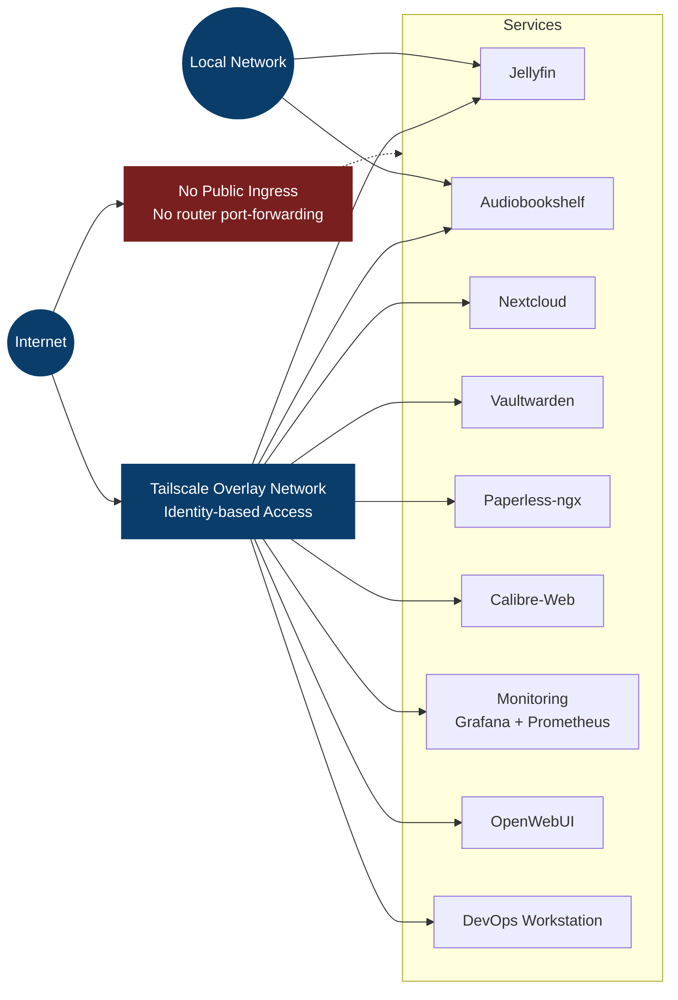

# Infrastructure Exposure Model

This diagram shows how services are accessed and how public ingress is prevented.

**Reading the arrows:** a solid arrow is a path that reaches a service. The dotted arrow is the one
that does not exist - it marks the absent ingress, not a restricted one.

This page answers "what is reachable from where". For "which rule allows it, on which port", see
[View 1 of the logical architecture](diagram.md#view-1---access-policy), which draws the ACL itself.

## What the diagram does not show

The picture above is the intended model, and it is accurate at the network boundary. It is not a
claim about how the individual services bind, and the 2026-08-17 audit measured the difference.

Several services listen on wildcard addresses on nodes that carry a routable IPv6: Apache on lxc210
(`*:80`, `*:443`), sshd on ten of eleven nodes, `rpcbind` on lxc210 (`0.0.0.0:111` and `[::]:111`),
`coolwsd` on `*:9983`, and lxc250's node_exporter on `*:9100`. So for those, what prevents
reachability from outside is the absence of a forwarding rule on the router, not the binding itself.
The platform's own binding rule - bind the Tailscale address, or bind loopback and publish through
`tailscale serve` - holds for every service that was installed deliberately, and not for the ones the
distribution brought along.

That gap is tracked rather than hidden: see the deferred items in the
[remediation plan](../platform/remediation-plan.md) and the binding rule in
[networking](../platform/networking.md). It is recorded here because this is the page a reader
arrives at when they want to know what is exposed, and a diagram alone would answer that question
too generously.
