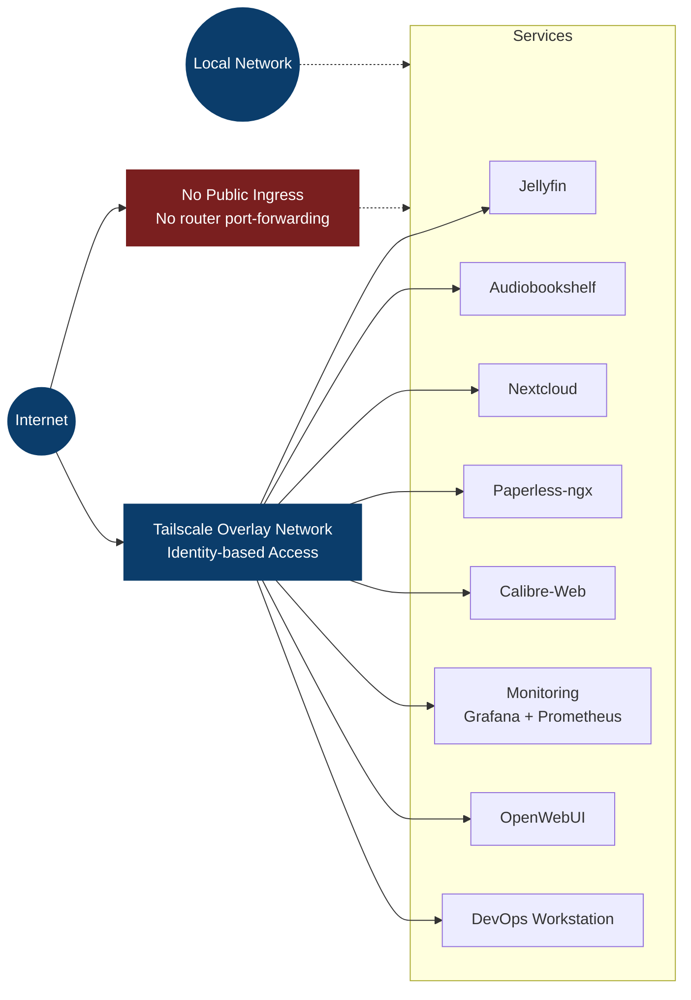

# Infrastructure Exposure Model

This diagram shows how services are accessed and how public ingress is prevented.

**Reading the arrows:** a solid arrow is a path that reaches a service. A dotted arrow is one that
does not exist - it marks an absent ingress, not a restricted one.

This page answers "what is reachable from where". For "which rule allows it, on which port", see
[View 1 of the logical architecture](diagram.md#view-1---access-policy), which draws the ACL itself.

```mermaid
flowchart LR

  Internet((Internet))
  LAN((Local Network))
  TS[Tailscale Overlay Network<br/>Identity-based Access]
  NoPublic[No Public Ingress<br/>No router port-forwarding]

  %% Internet access model
  Internet --> TS
  Internet --> NoPublic

  %% No direct exposure
  NoPublic -.-> Services

  subgraph Services
    Jellyfin[Jellyfin]
    ABS[Audiobookshelf]
    Nextcloud[Nextcloud]
    Paperless[Paperless-ngx]
    CalibreWeb[Calibre-Web]
    Monitoring[Monitoring<br/>Grafana + Prometheus]
    OpenWebUI[OpenWebUI]
    DevOps[DevOps Workstation]
  end

  %% LAN exposure: none since 2026-10-01 (lan_guard on every node)
  LAN -.-> Services

  %% Tailscale exposure (all services)
  TS --> Jellyfin
  TS --> ABS
  TS --> Nextcloud
  TS --> Paperless
  TS --> CalibreWeb
  TS --> Monitoring
  TS --> DevOps
  TS --> OpenWebUI

  classDef access fill:#0b3d6b,stroke:#0b3d6b,color:#ffffff
  classDef blocked fill:#7a1f1f,stroke:#7a1f1f,color:#ffffff
  class Internet,LAN,TS access
  class NoPublic blocked
```

## What the diagram does not show

The picture above is the intended model, and it is accurate at the network boundary. It is not a
claim about how the individual services bind.

Measured 2026-10-08 with `ss -ltn` on every node, these still listen on wildcard addresses: sshd on
three of ten nodes since the containers were pinned on 2026-10-10 (vm100, vm102, the hypervisor), Apache on lxc210 (`*:80`, `*:443`),
`coolwsd` on lxc210 (`*:9983`), and Samba on vm102 (`0.0.0.0:445`, for a reason the service cannot
avoid). What stops a LAN device from reaching them is the `lan_guard` nftables table on each node's
LAN interface, in place since 2026-10-01: it drops new inbound connections except DHCP, Tailscale's own UDP port, SMB to vm102 from vm100 and
the hypervisor, and break-glass SSH and netconsole to the hypervisor. The
router's missing forwarding rules still keep the internet out. Neither of the two is the binding
itself.

The platform's own binding rule - bind the Tailscale address, or bind loopback and publish through
`tailscale serve` - holds for every service that was installed deliberately, and not for the ones the
distribution brought along. That gap is tracked in the
[remediation plan](../platform/remediation-plan.md) and the binding rule in
[networking](../platform/networking.md). It is recorded here because this is the page a reader
arrives at when they want to know what is exposed, and a diagram alone would answer that question
too generously.
