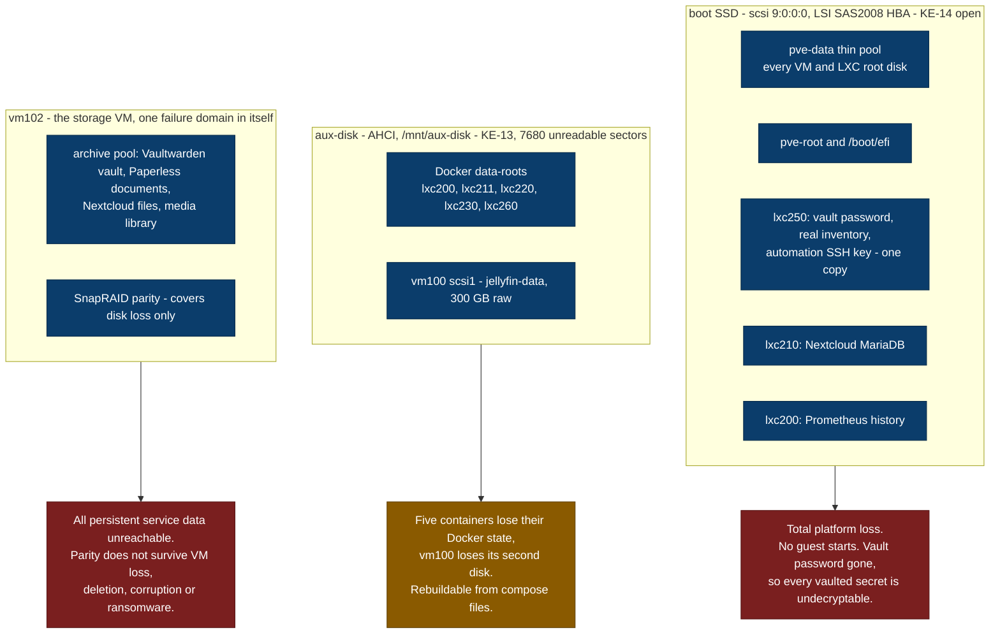

# Failure Domains - What Dies With What

The topology views answer how the platform is put together. This one answers the question an
operator asks first: if this piece of hardware goes, what goes with it.

**Reading this view.** Containment is ownership - what a device carries is drawn inside it. The
arrows are the exception to the convention used everywhere else on this site: here they do not
follow a payload, they follow loss. An arrow means "if the source fails, this is the consequence".

Three domains, and none of them is redundant. This platform has no high availability by design;
recovery is procedural. What follows is therefore a statement of exposure, not a complaint.

## The three domains

## What each domain means in practice

**Boot SSD.** It carries `/boot/efi`, `pve-root` and the whole `pve-data` thin pool, which is to say
every root disk on the platform. It also throws intermittent `DID_SOFT_ERROR` bursts inside the boot
window and only there - transport-layer faults at the SAS2008 HBA, media and firmware causes
excluded, leading hypothesis a sagging 12 V rail under peak boot draw
([KE-14](../platform/known-errors.md#ke-14), unconfirmed and awaiting physical verification).

The asymmetry worth noticing is not the disk, it is what sits on it. Two datasets on this device are
[classified C1](../platform/data-classification.md): lxc250's vault password with the real inventory
and the automation SSH key, in a single copy with no escrow, and Nextcloud's MariaDB. The database
half now has a nightly verified dump onto vm102; the secrets half has nothing, which is why it is
item 1 of the [remediation plan](../platform/remediation-plan.md) and not item 5.

Identify this disk by `9:0:0:0` or by `by-id`, never by its kernel letter - it enumerated as `sdc`
for a month of documentation and as `sda` on 2026-08-13.

**aux-disk.** Back in service under protest with 7680 unreadable sectors and `Reported_Uncorrect`
static at 21 since 2026-07-09 ([KE-13](../platform/known-errors.md#ke-13)). Static is not safe: those
sectors still hold data that cannot be read, and `smartctl -H` reports PASSED regardless, because
`Current_Pending_Sector` normalises to 054 against a threshold of 000 and can never trip the
self-assessment.

Its contents are the least valuable on the platform - container images and Docker state, class C3,
rebuildable from the compose files - with one exception that is not about data at all. vm100's
`scsi1` is a raw file on directory storage, and a raw file on directory storage cannot be
snapshotted, so vm100 has no rollback path at all. That is the reason a live CIFS unmount on that node
in [KE-20](../platform/known-errors.md#ke-20) could only be ended with `qm stop`, and the reason
making vm100 snapshottable is the precondition for investigating it.

The standing hold on `docker-compose-update` follows from this disk: the role pulls new images and
writes gigabytes of fresh layers onto a failing drive.

**vm102.** Parity is the protection everybody thinks of, and it is narrower than it looks. SnapRAID
computes one equation over the present contents of the data disks. It reconstructs a disk that
fails. It does not reconstruct a file deleted, truncated or encrypted before the next `snapraid
sync`, because that sync writes the damage into the parity. Against site loss it is worth nothing at
all, since the parity disk sits in the same machine.

Everything on this pool that matters is therefore protected against exactly one failure mode. What
protection each dataset actually has, and where it is missing, is drawn in
[backup and recovery](backup-flow.md).

## What is not a failure domain

The Proxmox host itself is a single point of failure in the ordinary sense - one machine, no
cluster - but it is not listed above, because its loss is a hardware-replacement problem rather than
a data problem: the guests live on the disks, and the disks are the three domains above. The
distinction matters when planning. A dead mainboard costs money and a weekend; a dead boot SSD
without an escrowed vault password costs data that cannot be recreated by any amount of either.

## Related

- [Storage design](../platform/storage-design.md) - the layout these domains are cut from
- [Data classification](../platform/data-classification.md) - what each dataset is worth
- [Backup and recovery flow](backup-flow.md) - what protection exists per dataset
- [Remediation plan](../platform/remediation-plan.md) - the ordering of the work these gaps imply
