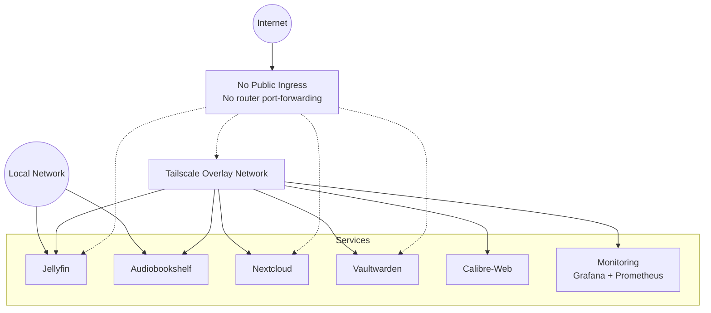

# Infrastructure Exposure Model

This diagram shows which services are reachable from which network layer.

```mermaid
flowchart TB

  Internet((Internet))
  LAN((Local Network))
  TS[Tailscale Overlay Network]

  NoPublic[No Public Ingress<br/>No router port-forwarding]

  Internet --> NoPublic
  NoPublic -.-> TS

  subgraph Services
    Jellyfin[Jellyfin]
    ABS[Audiobookshelf]
    Nextcloud[Nextcloud]
    Vaultwarden[Vaultwarden]
    CalibreWeb[Calibre-Web]
    Monitoring[Monitoring<br/>Grafana + Prometheus]
  end

  %% LAN exposure (media only)
  LAN --> Jellyfin
  LAN --> ABS

  %% Tailscale exposure (all services)
  TS --> Jellyfin
  TS --> ABS
  TS --> Nextcloud
  TS --> Vaultwarden
  TS --> CalibreWeb
  TS --> Monitoring

  %% No direct Internet access
  NoPublic -.-> Jellyfin
  NoPublic -.-> Nextcloud
  NoPublic -.-> Vaultwarden
```
