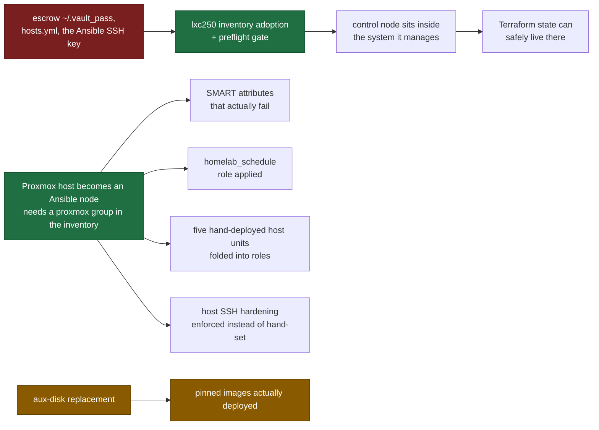

# Remediation Plan

Open platform work, ordered by loss risk and dependency, not by interest.

**This document holds ordering and nothing else.** The technical detail of every item lives in
[`known-errors.md`](known-errors.md), [`changelog.md`](changelog.md) and the runbooks, and is not
repeated here - a second copy would be the one that goes stale. What is *not* recorded anywhere
else is why these items must happen in this sequence, and that is what this file exists for.

No dates. Milestones are expressed as dependencies, so a slipped hardware delivery does not make
the document wrong. Update it in the same commit as the work it describes.

**Item numbers run once through the whole list, not once per tier.** Tier 1 ended at 4 and Tier 2
began at 4 until 2026-09-12, so two rows answered to the same name and the references to "item 4"
in this file pointed at different rows depending on which one the reader had just read. Numbers
here are addresses that other documents cite; a duplicate one makes the citation unresolvable.

For the same items read as security controls rather than as work - which standard control each one
implements, and which are enforced rather than merely practised - see
[`security-controls.md`](security-controls.md). It does not duplicate this ordering; it explains
what is at stake in each item's language rather than in this repository's.

---

## The dependency chain

Four items unblock most of the rest. Everything else is ordinary backlog.

**One edge was removed from this diagram on 2026-08-19, and its absence is the point.** The earlier
version drew `aux-disk replacement -> Proxmox host becomes an Ansible node`, which made the whole
right-hand branch look hardware-blocked and parked it behind a delivery date. The 2026-08-17 audit
measured that the coupling does not exist: the adoption needs a `proxmox` group in the inventory,
not a new disk. Only the amber chain waits on hardware.

The host-adoption chain is the important one: **four separate technical-debt entries in `CLAUDE.md`
all name "the host must become an Ansible node" as their prerequisite**, and none of them says what
else is waiting on it. That is the single highest-leverage move on this list.

---

## Tier 1 - Irreversible loss, not blocked on anything

Cheap in hours, catastrophic if left. Nothing here waits on hardware.

| # | Item | What is lost |
|---|---|---|
| 1 | ~~Escrow `~/.vault_pass`, `hosts.yml`, the Ansible SSH key off-site~~ Reported done 2026-08-20: credentials are held in an external password manager operated by a third party, with the most important ones written on paper off-site. Demoting the GitHub key to a read-only deploy key is still open | Substantially closed, with one thing left to confirm and one discipline left to start. **Confirm:** the item names three artefacts and only one of them is a password. `hosts.yml` and the Ansible SSH key are *files*, and a password manager holding "all passwords" does not necessarily hold them - check explicitly rather than by inference, because the failure mode is discovering the gap on the day the control node is gone. **Start:** an escrow that has never been restored from is the same fiction as an untested backup. The drill is a runbook since 2026-09-11 - [`escrow-restore-drill.md`](../../runbooks/platform/escrow-restore-drill.md) - with an execution log whose only row reads "not yet executed". It exercises all three artefacts rather than the password alone, which is the half this item kept describing and no procedure covered |
| 2 | ~~Execute `runbooks/database/pg-restore.md`, record the date, put it on a cadence~~ Done 2026-08-13. ~~Remaining: make the backup script verify its own output (`gzip -t` + completion marker) at write time~~ Done 2026-08-14 - plus write-to-`.partial`-then-rename, so an unverified dump never appears under the real name, and verification ordered before retention deletion | Closed. A dump that cannot be read now fails the run that wrote it and raises `SystemdUnitFailed`, instead of surviving up to 31 days until the monthly restore test - by which point the 7-day retention has deleted every healthy predecessor. Note the write-time checks prove the stream is complete, not that it is durable on vm102: the read-back is served from the CIFS page cache. Durability remains the restore test's job |
| 3 | Off-site copy of the C1 datasets defined in [`data-classification.md`](data-classification.md) | All backups are local, on the same site. No protection against site loss or ransomware. Scope defined 2026-08-15 - and this line's earlier wording was wrong. It read "off-site copy of the critical subsets (Vaultwarden export, Nextcloud DB, Paperless documents)", which presumes local copies exist that merely need duplicating elsewhere. Two of them do not exist: the Nextcloud MariaDB has no backup at all, and Vaultwarden has no consistent export. Those must be created first - an off-site copy of nothing is nothing. Status 2026-08-15: the MariaDB half is done and live - share provisioned on vm102, `mp1` bind, first verified dump on the share, metric scraped, `MariaDBBackupStale` inactive (`mariadb_backup` role + [runbook](../../runbooks/database/mariadb-backup.md)). The Vaultwarden half closed on 2026-09-01 by withdrawing the service rather than repairing it ([decision](../decisions/vaultwarden-decommission.md)): unused since February, four open items against it, and an unattended secrets store is worse than none. What remains under this item is an off-site copy of the archive pool. Measured 2026-09-04, it has none: the May 2026 mirror covers the same scope as `vzdump`, so the databases are off site and the Nextcloud files, Paperless documents and dump sets are not. **Target decided 2026-09-01** ([decision](../decisions/offsite-backup-target.md)): a small VPS running `rest-server` in append-only mode, written to by `restic`, which is the three-purpose machine this plan originally wanted, with two of the three purposes taken up now. Object Lock on object storage would be the stronger guarantee and was rejected on usability - a control that gets exercised beats one that reads better. The append-only configuration, a dedicated unprivileged account and server-side pruning are what stand in for it, and the residual risk is stated in the decision: root on the VPS can still delete. The C1 set was measured the same day at about 41 GB. The VPS is created by hand and adopted by Terraform afterwards, so the item does not wait on the learning track. **Status 2026-09-09: everything except the machine is built.** The `offsite_backup` role, the script, the timer, four alert rules and two runbooks exist - one for the daily job, one for provisioning the target. Two source nodes with a repository and an append-only account each, so a compromise of vm102 cannot read the credentials lxc250 holds. Nothing deploys until the VPS answers, and the role is deliberately out of the weekly sweep until then. What is left is buying the machine and running [`offsite-vps-provision.md`](../../runbooks/platform/offsite-vps-provision.md) |
| 4 | Guest backup - a restorable copy of the machines, not only of their data. Role and runbook exist since 2026-08-20, and the job has been running since. Measured 2026-09-09: last run 2026-09-06, `guest_backup_failed_guests 0`, 27.6 GB written, 205 s. Nine of ten guests since 2026-09-15, not seven: lxc220 has been backing up cleanly for some time, and lxc240 - added by the drift fix of 2026-09-09 - failed every run from that day, on eight paths in its rootfs owned outside the container's UID map. Repaired and verified the same day | Every VM and LXC root disk lives in one thin pool on one six-year-old SSD behind the HBA of [KE-14](known-errors.md#ke-14). The two database dumps restore *data* and Ansible restores *configuration*; neither restores a machine, and state that lives in neither - the Paperless index, Grafana's dashboards, Nextcloud's app config - is simply gone. That [`lxc250-rebuild.md`](../../runbooks/platform/lxc250-rebuild.md) exists is the measure of the gap: a rebuild runbook written because there is no restore. Blocked on nothing except the host adoption, since `vzdump` runs on the hypervisor. See [`guest-backup-restore.md`](../../runbooks/platform/guest-backup-restore.md) |

**Why item 1 no longer says "into Vaultwarden" (decided 2026-08-14).** Vaultwarden's persistent data
lives on `mp0: /mnt/smb/vaultwarden`, i.e. on vm102's MergerFS pool - so against the *predicted*
failure, the boot SSD dying, it genuinely would have been a second failure domain. But that is the
narrow reading. Against site loss, theft, fire, or ransomware spreading over the SMB mounts it
is worth nothing: same site, same power, same network. An escrow whose whole purpose is the
catastrophic case must not share a building with the original.

The corrected target is deliberately not a server: sealed on paper, kept outside the flat, plus
a copy in a password manager somebody else operates. The vault password is roughly 30 bytes of
static text that changes approximately never - a running system is the wrong medium for it, and
every additional machine is operational surface this fleet has already shown it does not
consistently supervise. A self-hosted VPS was considered and rejected for this purpose: it
answers "where does the secret live" with another system that itself needs credentials, which only
moves the root-of-trust question one hop and adds a hop that can fail. It becomes the right answer
once it carries item 3 (off-site backup target) and Terraform state as well - three purposes, not
one.

**And the same discipline as the dumps applies:** an escrow that has never been restored from is
the same fiction as an untested backup. Once a year, retrieve the paper copy and run
`ansible-vault view` against a vaulted file. Record the date, exactly as
[`pg-restore.md`](../../runbooks/database/pg-restore.md) does.

## Tier 2 - Blocked on hardware

| # | Item | Unblocks |
|---|---|---|
| 5 | aux-disk replacement ([KE-13](known-errors.md#ke-13)) - including erasure of the removed disk before it leaves the flat | Removes the last store with no off-site copy. It no longer gates `docker-compose-update`: that hold was lifted on 2026-09-05, so deploying the pinned images is now a matter of picking a session rather than waiting for hardware. The disposal half is not optional and has no owner yet: the disk carries C1 application data, and with 7680 unreadable sectors a software overwrite cannot be assumed to have reached every block, so the honest options are degaussing or physical destruction. This is the only Annex A control on the list with a deadline set by hardware delivery rather than by choice (A.7.14) |
| 6 | [KE-14](known-errors.md#ke-14) physical verification - 12 V rail, cable reseat, HBA temperature, PSU age | Not delivery-blocked. Needs only host downtime, which the nightly RTC cycle already provides. Written up as [`ke14-power-path-check.md`](../../runbooks/platform/ke14-power-path-check.md) on 2026-09-11, because four bullet points restated in three documents had not once become a scheduled step. The runbook also records the PSU, which is the A.7.11 gap in [`physical-controls.md`](physical-controls.md) |
| 7 | Consider moving the boot SSD off the LSI SAS2008 to an onboard SATA port | Hypothesis-discriminating: if the KE-14 bursts stop it was the HBA path, if they persist it is power. Either way the SSD regains TRIM, which the HBA currently blocks |

## Tier 3 - Unblocked by the host adoption

The adoption itself (item 8) happened on 2026-08-21; the host is in the inventory and is
reachable as an Ansible node. The heading read "behind" for eighteen days after the thing it
named was done, which is how a plan stops being read: an item that cannot move discourages
looking at the ones under it. Items 8 to 10 wait on nothing but a session.

| # | Item | Note |
|---|---|---|
| 8 | ~~Proxmox host becomes an Ansible node~~ Done 2026-08-21 | Closed. The host is in the inventory, `ssh_hardening` and `node_exporter` reach it, and the four technical-debt entries that named this as their prerequisite are unblocked. The trap this row used to carry - `node_exporter_textfile_dir` needing a `host_vars` override - was already obsolete when the adoption happened and is recorded in the changelog rather than here, because a warning kept alive past its fix deters the work it was written to protect |
| 9 | ~~Extend the SMART collector to the attributes that matter~~ Written 2026-09-09, applied 2026-09-15 | Debian's `prometheus-node-exporter-collectors` supplies `smartmon.sh`, which exports every attribute per disk as `value`, `worst`, `threshold` and `raw_value`, replacing a hand-written collector that exported two. Four rules fill the `smart` group, written on growth over 25 hours rather than on level - three disks would have made a level rule red on the day it was written, and the question KE-13 could never answer was whether the numbers were still moving. **This row read Done for six days before the role had run anywhere:** measured 2026-09-15, the package still sat in dpkg state `rc`, the retired collector still held its minute timer, and `smartmon_device_info` reached Prometheus from nowhere, so those four rules read nothing and were silent rather than red. Applied that day - 663 series over nine disks, the aux-disk's counters queryable instead of hand-read, fifteen leaked temporary files removed |
| 10 | Fold the hand-deployed host units into roles | **Four of the seven closed 2026-09-11** by the `proxmox_host_units` role: `lxc-fstrim`, `lvm-thin-metrics`, `check-smb-mounts.sh` with its unit, and the `netconsole` receiver - whose sending half had been a role since 2026-08-17 while its listening half was a file somebody typed, with a placeholder address and an install note telling the reader to substitute it. A fifth, the `pveproxy` drop-in, is folded onto the shared `wait-for-tailscale-ip.sh` through `tailscale_boot_gate` rather than copied into a second role, and that one is applied: measured 2026-09-12, the host carries `10-wait-tailscale.conf` from the role's template and nothing else, the hand-written `wait-tailscale.conf` is gone, `pveproxy` started through the gate at 12:48 with the ExecStartPre exiting 0, and a re-check of the playbook reports `changed=0` on all eleven hosts. What is left is `node_exporter` and the `wait-for-tailscale-ip.sh` copy the exporter's own role already deploys: replacing a running exporter is its own window and is held with that reason in `ansible/drift-sweep.conf`. ~~Add `/etc/snapraid.conf` on vm102~~ Done 2026-08-15 |
| 11 | Apply the `homelab_schedule` role | Decide cron vs. timer explicitly; cron is defensible here because the job powers the host down |
| 12 | ~~`is_mountpoint 1` on the `appdata_aux-disk` storage~~ Done 2026-08-17 | Closed. Proxmox now refuses to treat the storage as active unless a filesystem is actually mounted at the path, so a failed mount can no longer be written into the empty directory on `pve-root`. Verified immediately after: storage still `active`, vm100's `scsi1` still resolvable, guests untouched. Did not need the hardware window it was waiting on. Follow-up noticed while applying it: `mkdir 0` is deprecated and slated for removal in PVE 9, which this host already runs - the replacement is `create-base-path 0` |

## Tier 4 - Ordinary backlog

**External heartbeat (`Watchdog` alert -> off-site receiver), added 2026-08-14.** The measurement
behind it is in the [changelog entry for 2026-08-14](changelog.md): `PostgreSQLBackupStale` could
not see three backup-free days, because Prometheus runs on the host that was off. That is
structural, not a threshold to retune - **an observer sharing a failure domain with the observed
cannot report its total failure.** The standard fix is the `Watchdog` pattern that
`kube-prometheus` ships by default: an alert whose expression is simply `vector(1)`, firing
permanently on purpose and routed outward. If the external receiver stops seeing it, the whole
alerting chain is down. Cost here is one rule plus one Alertmanager route; the receiver must be a
service somebody else operates (a free heartbeat SaaS), because a self-hosted one needs a watcher
of its own. Note the fleet already builds absence-alerts twice - `LvmThinMetricsStale` and
`PostgreSQLRestoreTestStale` - this extends the same idea to the alerting chain itself.

**Built 2026-09-11, except the receiver.** The `Watchdog` rule and the Alertmanager route that
keeps it out of the Discord channel both exist. What remains is signing up for a receiver and
pasting its URL into the live `alertmanager.yml`, which is a decision about a third-party account
rather than a change to this platform. One number has to be right when that happens and is easy to
get wrong: the receiver's grace period must exceed the nightly off-window, or every morning opens
with an alarm about a host that powered down on schedule.

**Physical and environmental controls are undocumented (added 2026-08-15).** The whole A.7 family -
who has physical access to the machine, whether the disks are encrypted at rest, whether there is an
uninterruptible supply - has never been written down. It surfaces here because it stopped being
abstract: the leading hypothesis for [KE-14](known-errors.md#ke-14) is a sagging 12 V rail, i.e. an
open incident whose suspected cause is exactly the control nobody documented. Cheap to close on
paper, and the paper is what makes the KE-14 verification a planned step instead of a recurring
intention.

**Written 2026-09-11:** [`physical-controls.md`](physical-controls.md), rated honestly rather than
generously - three controls in the A.7 family are `None` and the supporting-utilities row is the
one that is load-bearing, because KE-14 already suspects the power path and the uninterruptible
supply has never been tested under load. Two things in it are decisions rather than omissions and
are recorded as such: disks are not encrypted at rest, which a nightly unattended boot makes
expensive to change on this board, and `pve-firewall` is off. The disposal step for the KE-13 disk
is the only item on this plan whose deadline is set by a delivery date.

**Fifteen drifted tasks across ten playbooks - measured 2026-09-08, closed 2026-09-09.** The weekly
sweep (`fleet_drift`) ran all 25 configured playbooks against eleven nodes in 4.3 minutes with no
failure and no unreachable host. Twenty-three tasks would change; eight were the three held items
recorded in `ansible/drift-sweep.conf`, leaving fifteen that nothing accounted for.

Every one was read as a diff before anything was applied, and the fifteen fell into three kinds.
Eleven were the ASCII punctuation pass reaching nodes that had not been re-run since it: em dashes
in script and unit comments on lxc210, lxc220, lxc260, vm100 and the hypervisor. Two were the
`breakglass` key labels on vm100 and vm102, where the keys themselves were identical and only the
comment beside them differed. Two carried substance: `paperless_env` still held the placeholder
`<tailnet-id>` that had rejected every browser login since 2026-06-09, and the hypervisor's
`guest-backup.sh` still lacked lxc240 in its `GUESTS` array.

All ten playbooks were applied. Re-checked immediately afterwards, all eleven playbook-and-node
pairs report `changed=0`, and the fleet holds no failed unit on any of the ten nodes. The lesson is
in the proportions rather than in any single line: thirteen of fifteen were cosmetic, which is
precisely why a sweep is needed to find the other two - nobody reads thirteen harmless diffs
looking for the fourteenth.

**Every scheduled hour in this repository meant two different times - closed 2026-09-08/09.** Nine
guests kept `Etc/UTC` while vm102 and the Proxmox host kept `Europe/Berlin`, so a bare `OnCalendar=`
hour fired two hours later in local terms on nine of eleven nodes while every schedule written down
here read as a local time. The `timezone` role now sets one zone fleet-wide and reads the node back
to confirm it took. Measured 2026-09-09, ten of ten inventoried nodes report `Europe/Berlin`.

One documented dependency was inverted by the old state and is corrected in `CLAUDE.md`: the
monthly restore test was said to rely on `lxc-fstrim` reclaiming its thin-pool blocks the same
morning, and fstrim in fact ran twenty-six minutes earlier, so the reclaim waited a day. With one
zone fleet-wide the two timers now mean what they say. `fleet_snapshot` and `fleet_drift` still
name the zone inside their calendar expressions, which is redundant now and deliberately kept: it
survives a node that is rebuilt before the role reaches it.

**MagicDNS does not resolve on lxc250 (found 2026-09-08, decided 2026-09-11:
[decision](../decisions/magicdns-and-systemd-resolved.md) - take `resolve` out of `nsswitch.conf`
on lxc250 first, and read the other six containers before assuming they match).** Any tooling on the control node that
addresses a node by its `.ts.net` name fails. The ACL is not the cause: the node holds `tag:admin`
and reaches every port. `systemd-resolved` is active, `/etc/nsswitch.conf` consults `resolve`
before `dns`, resolved knows nothing of the Tailscale resolver, and `[!UNAVAIL=return]` ends the
lookup before `/etc/resolv.conf` - which tailscaled had written correctly, with the right nameserver
and search domain - is ever consulted. A direct UDP query to the MagicDNS resolver answers.
`fleet-drift.sh` works around it with `curl --resolve`, which keeps SNI and certificate verification
intact.

**The closing sentence of this entry was wrong, measured 2026-09-12.** It read "the same nsswitch
ordering is on every Debian container here", which made a one-node fault look like a fleet decision
and is a large part of why the fix waited. All seven containers were read: lxc250 is the only one
carrying `resolve` in the line and the only one running `systemd-resolved`, the other six read
`files dns` with resolved inactive, and those six resolve both a short MagicDNS name and a fully
qualified one while lxc250 resolves neither. Built the same day as the `nsswitch` role, which owns
the line and then reads a name back through `getent` rather than reporting the file it wrote. Not
applied.

**Small open items.** A few lines each, collected because none of them blocks anything else.

- ~~The lxc250 `preflight.yml` gate~~ Done 2026-09-01, imported by every playbook that changes live
  state. The drift *metric* the original plan bundled with it is not part of this and is not
  scheduled yet. A metric written only when a playbook runs cannot see a control node drifting
  because nobody runs playbooks on it, so it would read healthy in the one state it exists to
  catch - the same shape as `PostgreSQLBackupStale` during an outage. It needs a timer independent
  of the runs. **Widened 2026-09-04:** the same blindness applies to the whole fleet, not just to
  the control node. `ssh_hardening` gained a task on 2026-07-08 that never reached seven of ten
  nodes, and nothing reported it for eight weeks ([KE-23](known-errors.md#ke-23)). The item is now
  a scheduled `--check` run across the state-changing playbooks, exporting the `changed` counts as
  a textfile metric with a rule that fires above zero. **Measured 2026-09-08:** six playbooks
  across eleven nodes, 115 s, `rc=0` throughout, three drifts - `ssh_hardening` and
  `node_exporter` on the Proxmox host (both already recorded here) and the `systemd_hygiene`
  masking lxc250 never received, which nothing knew about. Three findings the run cannot make
  by itself. The exit code is not the signal: every run returned 0, drift or not, so the
  `changed=` counters in the recap are the only source. A `--check` run is not uniformly
  read-only: nine roles carry `check_mode: false`, seven of them read-only queries, while
  `prometheus_config` writes a staged file and runs promtool and `netconsole` sends a ping.
  And the two host drifts are held on purpose, so a rule on `changed > 0` would be red from
  the first day. **Armed 2026-09-12** and confirmed here 2026-09-16: `drift-sweep.conf`
  carries a `[baseline]` of three held entries with a reason above each, the sweep subtracts
  them, and `FleetDriftUnexpected` fires on what is left over. The last run read
  `changed_total 8` against exactly those three baselines and `unexpected_total 0`. The
  complementary half is built as well: `fleet_snapshot` covers what no role manages, which is
  where `--check` is blind by construction.
  **What the sweep did not cover until 2026-09-16** is itself. `timezone`, `fleet-drift` and
  `fleet-snapshot-schedule` import the preflight gate and were in neither the sweep list nor
  the exclusions, and the deployed `fleet-drift.sh` had been a commit behind this repository
  since 2026-09-15 with no way to say so. All three are swept now and Check 44 holds the
  membership.
- ~~Adopt the Proxmox host's `00-hardening.conf` into `ssh_hardening`~~ Done 2026-09-16. The
  `--check --diff` confirmed what the item predicted: `PasswordAuthentication no` and
  `PermitRootLogin prohibit-password` stand unchanged on both sides and only the comment block
  changes owner, so the run was a transfer of ownership with no configuration in it. The missing
  physical recovery path was answered with a dead-man switch rather than a second person: a
  `systemd-run --on-active=300` unit holding a copy of the old file and a restart, armed before
  the run and cancelled after a *new* connection had been opened and `sshd -t` had passed. Worth
  reusing - it is the only recovery path a single operator has on a host whose console is inside
  a passed-through GPU.
- ~~`DATA_SOURCE_NAME` for `postgres_exporter` into the vault~~ Built 2026-09-09, one inventory
  line from done. The role now owns `/etc/postgres_exporter.env` behind
  `postgres_exporter_manage_env`, which defaults to false. The flag is not caution for its own
  sake: a role that fails on an undefined vault variable would break the weekly sweep for the node
  it runs against, and a sweep reporting `errored` for work nobody has finished configuring is how
  a red signal becomes background. **Closed 2026-09-16, applied and verified.**
  `vault_postgres_exporter_dsn` is in `group_vars/all/vault.yml` and the flag is on in
  `host_vars/lxc260.yml`. The ciphertext was made on the control node from the value read on
  lxc260, so neither the vault password nor the plaintext reached a workstation, and the two
  were proven identical by comparing SHA-256 digests rather than by looking at either. What the
  run changed is ownership, not content: `postgres_exporter:600` became `root:600`, because
  systemd reads an `EnvironmentFile` as root before dropping to `User=` and the service account
  never needed read access to its own credential. Measured after the run: the file reads
  `root:root 600`, the DSN still hashes to `e3c0405e...`, so nothing about the credential changed,
  and the exporter answers with 540 `pg_` series at `NRestarts=0`.
- ~~Pin journald `Storage=persistent` and an explicit `SystemMaxUse=` on vm100 and vm102~~ Role
  written 2026-09-09, applied on all ten nodes 2026-09-15 - the six days in between are the
  entry worth keeping, because the role's own read-back could not tell the difference. It
  asserted that `journalctl --header` names a file under `/var/log/journal`, which holds under
  `auto` as well, so ten nodes without the drop-in reported success. It now reads the merged
  configuration through `systemd-analyze cat-config`, where the last assignment of a key wins,
  which also catches a drop-in sorting after `10-`. The hypervisor takes `2G` rather than the
  fleet's `512M`, for the reason recorded beside the value in `group_vars/proxmox.yml`. The item
  named vm100 and vm102 because those were the nodes somebody had looked at; measured, `Storage=` and
  `SystemMaxUse=` were unset on every inventoried node, so the recorded defect was a fleet-wide
  default. Journal volume ranges from 386 MB on lxc250 to 1.3 GB on the hypervisor, against a
  systemd default cap of 10 % of the filesystem - which on lxc250's 7.8 GB root is roughly 780 MB
  with 2.0 GB free.
- ~~Fold the `pveproxy` drop-in onto the shared `wait-for-tailscale-ip.sh`~~ Done 2026-09-11. The
  host is in `tailscale_boot_gate` and the superseded `wait-tailscale.conf` is named in
  `tailscale_boot_gate_obsolete_dropins`, because the role's `10-` prefix sorts first and a
  hand-written file left beside it wins every directive the two share.
- `SystemdUnitFailed` coverage for lxc200, the last node without it; its exporter is a container
  that cannot see the host's systemd. lxc250 was the second until 2026-08-20. **Decided
  2026-09-11** ([decision](../decisions/lxc200-systemd-visibility.md)): a native `node_exporter`
  beside the container on a second port, not a privileged container and not a bind-mounted systemd
  socket - that is a large authority grant on the node that holds the alerting stack, to close a
  monitoring gap. Two exporters on one node with one job each, which is untidy on purpose and
  recorded so a later reader knows which of the two was load-bearing. Not implemented: it adds a
  scrape target to the rendered Prometheus config, so it wants the same session as that change.
  **Built 2026-09-12, not applied.** The exclusion is gone from `node-exporter.yml`, the port is in
  `host_vars/lxc200.yml`, and the job is in the template under a name of its own - the loop would
  have rendered it as a duplicate of the container's job, which Prometheus answers by refusing the
  entire file. Attempted 2026-09-15 and stopped at the first run: the unit installed and then exited
  `217/USER`, because no role has ever created the `node_exporter` account and lxc200 was the one
  node this playbook never reached. The nine that have it were made by hand before the role
  existed. The role now creates the group and the account, with no uid pinned - the nine sit on
  996 and 999 depending on what was free at the time. **Closed 2026-09-15** by both runs in
  that order, the second adding a scrape target the first had to be answering: the native exporter
  binds the node's Tailscale address on 9101, both jobs report `up`, and 895
  `node_systemd_unit_state` series arrive from lxc200. The only instance left without them is the
  container exporter on `127.0.0.1:9100`, which is the one that cannot see the host's systemd and
  is why there are two. No node on this fleet is outside `SystemdUnitFailed` any more.
- ~~`fleet-snapshot.yml` runs `become: true` against every node once a week~~ Done 2026-09-09. The
  grant now sits on the two tasks that need it, root's crontab and the Docker socket, and the play
  runs unprivileged otherwise. Verified rather than assumed: the three countable projections -
  listening sockets, mount table, enabled and masked unit files - return byte-identical counts on
  all ten nodes with and without `become`, so nothing narrowed. That check is the point. A
  privilege reduction that quietly reads less is worse than the grant it removed, because the
  snapshot would keep reporting and cover less.
- ~~Clear the orphaned `smart.prom.*` temporary files from the host's textfile directory~~ Done
  2026-09-09. The leak is closed at its source rather than swept: the script whose `mktemp` had no
  cleanup trap is retired with item 9, and the `smart_metrics` role removes any `*.prom.*` left in
  the directory older than an hour. Fourteen files dating back to 2025-12 were cleared. The
  companion observation stands and belongs to item 10 - `lvm-thin-metrics.sh` leaked one the same
  way, and it is still hand-deployed.

**Closed on 2026-09-01.** The disabled `tailscaled-userspace.service` file on lxc220 is deleted,
with two further orphans on that node ([KE-22](known-errors.md#ke-22)).
[KE-5](known-errors.md#ke-5), the Vaultwarden migration off CIFS, is closed by decommissioning the
service ([decision](../decisions/vaultwarden-decommission.md)).

## Added by the 2026-09-16 assessment

A review from the DevOps and DevSecOps seats, against the running fleet rather than against the
documents. Everything the existing machinery watches came back clean, so what follows is what sits
outside its field of view. These four are ordinary work and are ordered by exposure.

- **Nothing on this platform measures its patch level.** Measured: the hypervisor has 228 packages
  pending, 55 of them security; vm102 has 62 pending and 23 security; lxc220 has 13 and 7. The
  remaining nodes were current. `unattended_upgrades` targets exactly one node, vm100, and there is
  no metric and no rule anywhere for pending updates - `apt-upgrade.yml` is excluded from the drift
  sweep for a good reason, since `apt` refreshes its cache even under `--check`, so patch level is
  the one large property of this fleet that nothing observes. Measurement comes first, the way it
  did for the SMART counters: `prometheus-node-exporter-apt.timer` is already installed on the
  hypervisor and sits `masked`, collateral from the collector cleanup of 2026-09-15. Unmask it, own
  it in `smart_metrics` or a sibling role, alert on security updates pending beyond a threshold.
  Only then the policy question, which is different per node class: the Debian containers can take
  the same origin-restricted `unattended_upgrades` vm100 has, while the hypervisor holds `pve-*`
  packages and a kernel upgrade there costs eleven guests.
- **lxc250 answers LLMNR and mDNS on the LAN.** `systemd-resolved` holds four sockets on
  `0.0.0.0:5355` and `[::]:5355`, `resolvectl` reports `+LLMNR +mDNS`, and nothing in this
  repository sets either - both stand at their compiled defaults. It is the only node on the fleet
  with that listener, and it is the node that holds hypervisor root, the only `~/.vault_pass`, the
  Ansible SSH key and the only real `hosts.yml`. LLMNR has no authentication: a host on the same
  segment can answer a lookup that DNS failed and take the connection. The platform binding rule
  forbids exactly this, and the Tailscale ACLs cannot help, because none of it is tailnet traffic.
  It arrived with the `nsswitch` change of 2026-09-12, which enabled `systemd-resolved` so MagicDNS
  names would resolve: the role owns the `hosts` line and nobody owns the protocol switches - the
  same shape as the `node_exporter` that bound `*:9100` because its unit carried no listen address.
  Remedy is a drop-in under `/etc/systemd/resolved.conf.d/` with `LLMNR=no` and `MulticastDNS=no`,
  owned by the `nsswitch` role, proven by `resolvectl status` and an empty
  `ss -tulnp | grep 5355`. Worth checking the administrator workstation for the same default; the
  sweep only sees the fleet.
- **MariaDB has a backup and no proven way back.** PostgreSQL carries write-time verification, a
  monthly restore into a throwaway cluster, `PostgreSQLRestoreTestStale` at 40 days and a restore
  runbook. MariaDB, live since 2026-08-15, has the dump, `MariaDBBackupStale` and a backup runbook,
  and neither a restore test nor a restore runbook. It is the half that makes Nextcloud's files
  mean anything, and a dump nobody has restored is an assumption. The pattern exists: mirror
  `postgresql_restore_test` into a throwaway instance, assert non-empty key tables, export the
  metric, add the staleness rule.
- **The sshd binding decision, first node done 2026-09-17.** lxc220 carries the gate and the
  pinned bind; nine nodes still hold `*:22`. Continue one per session, containers before the
  hypervisor. The finding as written:
- **The sshd binding decision had not been executed on any node.** `ssh_hardening_listen_address`
  appears only as the empty default in the role, and every node still binds `*:22`, measured. The
  decision of 2026-09-11 calls for one node per session with the containers first
  ([decision](../decisions/sshd-listen-address.md)). A decision that is never executed reads, six
  months later, as a solved problem. The dead-man switch used for the hypervisor's sshd on
  2026-09-16 is the recovery pattern for it, and it is now proven.

## The exercise block, before Terraform

Four controls that the same assessment argued against building at this scale, being built
anyway and for a reason that is not operational: to have run the thing once and to be able to say
what it looks like where it belongs. The reasoning, the labelling rules and the exit condition are
in [the decision](../decisions/exercise-scope-before-terraform.md), which also carries the
homelab-versus-workplace comparison this block exists to produce.

Read the labelling as part of the work rather than as documentation afterwards. None of these
enters `security-controls.md` as `Enforced`, none of them gets an alert that would not have been
built regardless, and each is revisited once the Terraform track has started.

- `auditd` on a node or two, plus `dpkg --verify` as a projection in `fleet_snapshot`. The second
  half is the one with standalone value and is cheap: package integrity, into a weekly diff that
  already exists.
- Central log aggregation for the journals of ten nodes that power down nightly.
- High availability far enough to see quorum, fencing and what a single node arms against itself.
  Not left running: an HA stack on one node with no quorum partner fences the node it protects
  ([decision](../decisions/hypervisor-panic-and-watchdog.md)).
- An SBOM for the compose stacks, with signature verification where the images allow it.

**This block is the end of maintenance mode.** When these four and the four items above are done,
the Terraform track begins.

## Added by the 2026-08-20 repository and fleet audit

A full sweep of both sides before the Terraform track. The repository passed all 33 checks; the
fleet held no failed unit, no firing alert and no dead scrape target, and both database dumps were
current. What follows is what that clean surface did not cover. The guest-backup finding is Tier 1
item 4 above; these are the rest.

- **The binding rule is violated by sshd on ten of eleven nodes, not on one.** Measured: `*:22` on
  lxc200, lxc210, lxc211, lxc220, lxc230, lxc240, lxc260, on vm100, on vm102 and on the Proxmox
  host. Only lxc250 pins `ListenAddress` to its Tailscale address. `CLAUDE.md` and `vm100.md` name
  vm100 as the exception to a rule the fleet otherwise follows; it is the other way round, and the
  design decision those documents defer is therefore a fleet decision rather than a node one. The
  acute risk stays closed - password authentication is off everywhere - so this is a correctness and
  honesty problem, not an urgent one.
- **The host runs `rpcbind` on `0.0.0.0:111` and `[::]:111`.** Same finding as the one recorded for
  lxc210 on 2026-08-17, on the hypervisor, unmentioned. Neither node has a use for it. The lxc210
  half is closed on 2026-09-11 by removing `nfs-common` and `rpcbind`, which also retired the
  [KE-3](known-errors.md#ke-3) mask. The hypervisor half is deliberately left: Proxmox's own
  packages relate to `nfs-common` and a removal there could take a `pve-*` package with it, so it
  needs the simulated removal read by a person rather than the same host var copied across.
  **Read 2026-09-12, and the fear was justified.** `apt-get -s remove --purge rpcbind nfs-common`
  on the host lists `proxmox-ve`, `pve-manager`, `pve-container`, `qemu-server`, `pve-ha-manager`,
  `libpve-storage-perl` and `libpve-guest-common-perl` among the packages it would take - the
  cleanup that was right on a container would remove the hypervisor's management stack. The port is
  closed by masking `rpcbind.socket` and `rpcbind.service` instead, declared in
  `group_vars/proxmox.yml`: no NFS storage is configured, `rpc-statd` is static and inactive, and
  `sockets.target` only wants the socket, so a mask is skipped rather than failed. Built, not
  applied.
- ~~**Alertmanager on lxc200 binds `*:9094`.**~~ Closed 2026-09-11 with
  `--cluster.listen-address=`, an empty value that disables the gossip listener outright. The port
  was open because Alertmanager clusters by default and the container runs with host networking; a
  cluster of one had nobody to gossip with, so it carried no traffic and no benefit. The
  `docker compose up -d` that this line named as outstanding happened on 2026-09-15, and the
  measurement in between is the interesting part: the live compose file on lxc200 differed from
  the repository in exactly one block, the one carrying this change. `*:9094` was still open
  four days after the row was struck through.
- **`pve-firewall` is disabled.** Defensible on a host whose exposure is governed by Tailscale ACLs
  and by the nftables guard on vm102, but it is a security posture nothing states, and an undocumented
  deliberate choice is indistinguishable from an oversight at review time.
- **The boot SSD is a consumer drive with 58,540 power-on hours.** `Wear_Leveling_Count` normalises
  to 047 at 633 program-erase cycles, and `Used_Rsvd_Blk_Cnt_Tot` carries `WHEN_FAILED=In_the_past`
  with a worst value of 001 against a threshold of 010 - it has been below its threshold at some
  point, though the raw value reads 0 and the current value 100, which is consistent with a known
  firmware artefact on this drive family. [KE-14](known-errors.md#ke-14) excludes media and HBA
  firmware as causes and never mentions the drive's age. It carries every guest root disk.
- ~~**The package that closes item 9 was already installed and then removed.**~~ Acted on
  2026-09-09, and half of it was wrong. `prometheus-node-exporter-collectors` did sit in dpkg state
  `rc`, it does ship `smartmon.sh`, and the work was indeed a reinstall plus a drop-in rather than a
  script to write. But no `prometheus-node-exporter-*.timer` units survived the removal: measured,
  the unit files leave with the package and only its configuration stays. A finding written from a
  plausible inference rather than from a command reads as fact three weeks later.
- **The SMART collector exports drive serial numbers as a Prometheus label.** Nine of them, in the
  time series database and in every panel built on it. Still true of the packaged collector that
  replaced it on 2026-09-09, and now deliberate rather than incidental: `smartmon_device_info`
  carries the serial, and it is what turns an alert naming `/dev/sdi` into an instruction about
  which disk to unplug. Kernel letters are not stable here - the boot SSD was documented as `sdc`
  for a month and enumerated as `sda` ([KE-14](known-errors.md#ke-14)) - so the label that survives
  a reboot is the one worth alerting with. The series stay inside the tailnet and reach this
  repository nowhere.
- **VM100's unsnapshottable disk holds 18 GB.** Its `scsi1` is a 300 GB raw file on directory
  storage, and `/mnt/vm-data` inside the guest is 7 % used. The constraint recorded in `CLAUDE.md`
  is real; the migration it blocks is an order of magnitude smaller than the disk's nominal size
  suggests.
- **A second copy of the real inventory sits on lxc250.** `backup-hsa-20260709-premerge-abort/`,
  8.4 MB, from the mid-merge abort of 2026-07-09, containing `ansible/inventory/hosts.yml`. Beside
  it, `backup-hsa-pre-sanitization-20260710/`, `homelab-docs.zip` and a stray clone whose directory
  name is the repository's with a trailing dash. The gitignored inventory is treated as a single
  copy everywhere in these documents; it is not.
- **The `pveproxy` drop-in carries a non-English comment and an inline Tailscale address.** It
  predates the shared `wait-for-tailscale-ip.sh` and was never folded into it, so the host holds two
  spellings of one readiness gate - one of which hard-codes an address that `tailscale ip -4` would
  supply.
- **Item 10 undercounts.** There are eight hand-deployed host artefacts, not five: the five listed,
  plus `check-smb-mounts.sh` with `smb-mounts-check.service`, the `node-exporter-smarttext.sh` timer
  pair, and the `pveproxy` drop-in above.
- **The Proxmox host document has no `## Failure Impact` section.** Check 6 requires one of every
  document under `docs/nodes/`, and the host lives in `docs/platform/`, so the single point of
  failure for the entire platform is the one node whose failure is not written down. Added in the
  same pass as this entry.
- **An off-site copy exists and is documented nowhere.** A rescue of the auxiliary disk's contents
  was taken to an administrator workstation on 2026-06-25 and is still there, on encrypted storage,
  in a different building from the server. It is a point-in-time copy roughly eight weeks old, not a
  running backup, and its error logs contain only `socket ignored` lines from container runtime
  sockets, so the copy itself is complete. A second mirror on removable media is reported to exist
  from May, likewise unrecorded. Neither changes the plan, but "no off-site copy of anything" was
  not accurate.
- **The rest was confirmation rather than discovery**, and is listed only so the measurements have a
  date. Struck through where a later measurement closed it. SnapRAID scrub coverage has degraded
  from 123 to 126 days on the oldest block with 74 % of the array unscrubbed and
  `SnapRAIDScrubStale` green; no compose stack on the fleet runs a pinned image; ~~eleven orphaned
  `smart.prom.*` temp files remain~~ cleared 2026-09-09, fourteen by then; ~~lxc220 still holds the
  disabled `tailscaled-userspace.service` file~~ deleted 2026-09-01; ~~lxc250's `node_exporter` ran
  argument-free on `*:9100` and is scraped by nobody, its sshd drop-in still retries rather than
  waits, and its root filesystem is at 73 % with no alert~~ all three closed 2026-08-20 by the
  inventory adoption, the `tailscale_boot_gate` role and the scrape that `DiskSpaceCritical` reads;
  `journald` `Storage=` is unset on vm100 and vm102; the deprecated `mkdir 0` remains in
  `storage.cfg` on a host already running PVE 9; and the KE-13 auxiliary disk reads 21 and 7680
  unchanged since 2026-07-09 - sixty-two days in service, re-read 2026-09-09, with no new
  uncorrectable error.

## Added by the 2026-08-17 repository audit

Every documented claim was checked against the running fleet. Most findings were documentation
drift and are corrected in place; these are the ones that are work rather than wording.

- ~~**A `mergerfs` directory storage in `storage.cfg` points at `/mergerfs`, which is not a
  mountpoint.**~~ Removed 2026-08-17. It was registered for `images,rootdir` with `shared 1`, and
  `pvesm status` reported it with the same free space as `local` - it would have allocated straight
  into `pve-root` on the KE-14 boot SSD. Item 12's failure class with one aggravation: the aux-disk
  storage at least has a disk that could fail to mount, this one had none. Verified unused before
  removal - three empty directories totalling 16 KB, no guest config referencing it, no backup job,
  no replication entry. The definition is gone; `/mergerfs` itself was left in place, because
  removing a config line is reversible and removing a directory is less so.
- **Nothing on the fleet runs a pinned image.** Every compose stack runs `:latest` or `:main` while
  the repository pins exact versions, and lxc200's live compose file still carries the
  `# TODO: pin to specific version tag` the repository copy has already resolved. The repository
  file is therefore not the deployed file. Two consequences: there is no rollback point, and the
  weekly Trivy scan measures images that are not running - its own comment claims the compose files
  "cannot drift from reality", which is the assumption this measured. Coupled to item 5: applying
  the pinned files means running `docker-compose-update`, which the aux-disk hold forbade until
  2026-09-05. What it needs now is a session somebody is watching, not a delivery date.
- ~~**`SnapRAIDScrubStale` cannot see scrub coverage.**~~ Closed 2026-09-11 by four rules reading
  `snapraid status` from a timer independent of the sync, plus `snapraid touch` in the nightly run.
  **What the fix exposed is now the open item:** the coverage is not poor because the job is
  broken, it is poor because a monthly scrub at snapraid's default 8 % takes about a year for a
  full pass. So the thresholds are set above today's measurement rather than where anyone would
  want them, and the real question is the cadence. **Answered 2026-09-12, and the number was
  already on the node.** The scrub timer last fired at 20:00:03 on 2026-09-01 and
  `snapraid_scrub_last_success_timestamp` reads 21:10:36 the same evening: 8% of this array takes
  70 minutes, so a full pass is 12.5 runs and the monthly schedule verified everything once every
  12.5 months. The schedule is now weekly at 12%, which covers the 66% that no scrub has ever
  reached in about five and a half weeks - before `SnapRAIDScrubCoverageAging` trips at 200 days,
  which the oldest block reaches around 2026-11-01 at one day per day. Both operations now export
  their own duration, so the next change to this schedule starts from a measurement rather than
  from this paragraph. Not applied yet. The original finding read: it measures when a scrub last ran, not how
  much of the array that scrub reached. Measured 2026-08-17: the last run was twelve days ago and
  the rule is green, while `snapraid status` reports the oldest block scrubbed 123 days ago and
  74 % of the array unscrubbed. Same class as `smart_health_passed` and `PostgreSQLBackupStale` -
  the guard measures that the job ran, not that it achieved anything. Both numbers are already in
  the `snapraid status` output, so exporting them from `snapraid-maintenance.sh` as two more
  textfile metrics is small. Run `snapraid touch` in the same pass: 63322 files carry a zero
  sub-second timestamp, which weakens change detection.
- **The archive pool has months, not years.** 198 GiB free against a 100 GiB alert threshold, with
  every member disk between 29 and 37 GiB. The alert still fires before writes fail, so this is
  runway rather than a defect - but it belongs on a plan with the hardware order rather than in
  prose as "small and shrinking".
- **`node-exporter-smarttext.sh` has no copy in the repository.** The other two hand-deployed host
  scripts do. It also carries non-English comments, so item 9 begins with bringing the script under
  version control and translating it, not with adding attributes. Its `mktemp` has no cleanup trap,
  which is where the orphaned temp files come from.
- ~~**lxc250 is at 73 % of its 8 GB root and nothing watches it.**~~ Closed 2026-08-20 by the
  inventory adoption: the node is scraped, so `DiskSpaceCritical` covers it like every other. The
  fill is unchanged - 74 % measured 2026-09-09 - which is the part worth keeping. The finding was
  never about the number; it was that the number was unobserved on the one node whose loss item 1
  calls unrecoverable.
- ~~**Collabora Online (`coolwsd`) runs on lxc210, undocumented, on `*:9983`.**~~ Measured
  2026-09-09 and closed 2026-09-11. There is no `coolwsd` package and no unit: a Nextcloud app
  extracts an AppImage into `/tmp` and runs it, so no role can own it without owning the app, and
  it offers no listen-address setting. The `*:9983` bind is therefore closed one layer down, by the
  `nft_guard` role - loopback accepted, the port dropped everywhere else, which is what Nextcloud's
  `proxy.php` already uses. Still open and separate: `onlyoffice` is enabled with an empty document
  server URL, a second office backend that cannot work.
- ~~**`nfs-common` on lxc210 is the cause the `systemd_hygiene` mask treats as a symptom.**~~ Closed
  2026-09-11. The role gained `systemd_hygiene_absent_packages`, which simulates the removal with
  `apt-get -s` and refuses if apt would take anything beyond the named packages, and
  `systemd_hygiene_retired_units`, which unmasks and deletes the leftover symlink. Two audit
  findings eight months apart turned out to be one package.

**What this changes about the dependency chain at the top.** The host adoption was described as
unblocking four technical-debt entries. It unblocks six: the audit found the Proxmox host running
`PermitRootLogin yes` with `PasswordAuthentication yes`, and lxc250 accepting password
authentication - both because `ssh_hardening` only ever reached the nine inventoried nodes. Those
two are security findings rather than rebuild risks, and neither of them waits on hardware. The
adoption itself does not either: it needs a `proxmox` group in the inventory, not a new disk.

---

## Deferred on purpose

- **Apache on lxc210 binding `*:80`/`*:443`.** Still deferred, and still a project rather than a
  fix: the plausible answer is moving Nextcloud behind `tailscale serve`, which would also retire
  [KE-16](known-errors.md#ke-16) entirely. **The sshd half is no longer deferred** - decided
  2026-09-11 in [`sshd-listen-address.md`](../decisions/sshd-listen-address.md), with the mechanism
  built and defaulted off. `ssh_hardening_listen_address` pins the bind and the role refuses to
  write it unless the node also carries the boot gate that makes a failed bind survivable. The
  rollout is deliberately one node per session, LXCs first because `pct exec` recovers them, and
  the hypervisor last or never - it is the one node where the recovery cost exceeds the exposure.
  The original entry read:
  both are real binding-rule violations, and both need their own design decision. The sshd half was
  recorded here as a vm100 defect until the 2026-08-17 sweep measured it: lxc250 is the only node
  that pins `ListenAddress`, and every other node - both VMs, the hypervisor and all seven
  inventoried LXCs - binds `*:22` dual-stack on hosts carrying a routable IPv6. The KE-6 lesson
  about sweeping the fleet had been applied to services somebody installed deliberately and not to
  the ones the distribution brings - the lxc210 fix is plausibly
  "move Nextcloud behind `tailscale serve`", which would also retire [KE-16](known-errors.md#ke-16)
  entirely. That is a project, not a fix to bolt onto an unrelated pass.
- **Alertmanager routing and per-tier dashboards.** The alerts exist; only delivery is crude.
- **Molecule.** Out of scope for the current learning arc, per the roadmap.
- **KE-3, KE-11, KE-17.** Non-blocking, or no confirmed root cause to act on.
- **[KE-10](known-errors.md#ke-10) (Jellyfin CUDA loss).** Deferred, but note it is *active*, not
  historical - the watchdog restarted Jellyfin on 2026-08-07 and 2026-08-10. The workaround
  absorbs each occurrence silently, which is why it looks dormant.
