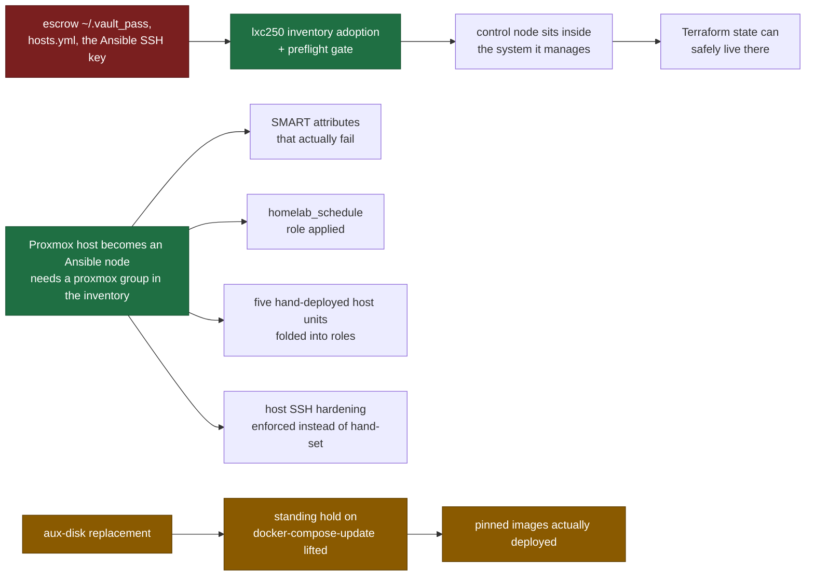

# Remediation Plan

Open platform work, ordered by loss risk and dependency, not by interest.

**This document holds ordering and nothing else.** The technical detail of every item lives in
[`known-errors.md`](known-errors.md), [`changelog.md`](changelog.md) and the runbooks, and is not
repeated here - a second copy would be the one that goes stale. What is *not* recorded anywhere
else is why these items must happen in this sequence, and that is what this file exists for.

No dates. Milestones are expressed as dependencies, so a slipped hardware delivery does not make
the document wrong. Update it in the same commit as the work it describes.

For the same items read as security controls rather than as work - which standard control each one
implements, and which are enforced rather than merely practised - see
[`security-controls.md`](security-controls.md). It does not duplicate this ordering; it explains
what is at stake in each item's language rather than in this repository's.

---

## The dependency chain

Four items unblock most of the rest. Everything else is ordinary backlog.

**One edge was removed from this diagram on 2026-08-19, and its absence is the point.** The earlier
version drew `aux-disk replacement -> Proxmox host becomes an Ansible node`, which made the whole
right-hand branch look hardware-blocked and parked it behind a delivery date. The 2026-08-17 audit
measured that the coupling does not exist: the adoption needs a `proxmox` group in the inventory,
not a new disk. Only the amber chain waits on hardware.

The host-adoption chain is the important one: **four separate technical-debt entries in `CLAUDE.md`
all name "the host must become an Ansible node" as their prerequisite**, and none of them says what
else is waiting on it. That is the single highest-leverage move on this list.

---

## Tier 1 - Irreversible loss, not blocked on anything

Cheap in hours, catastrophic if left. Nothing here waits on hardware.

| # | Item | What is lost |
|---|---|---|
| 1 | ~~Escrow `~/.vault_pass`, `hosts.yml`, the Ansible SSH key off-site~~ Reported done 2026-08-20: credentials are held in an external password manager operated by a third party, with the most important ones written on paper off-site. Demoting the GitHub key to a read-only deploy key is still open | Substantially closed, with one thing left to confirm and one discipline left to start. **Confirm:** the item names three artefacts and only one of them is a password. `hosts.yml` and the Ansible SSH key are *files*, and a password manager holding "all passwords" does not necessarily hold them - check explicitly rather than by inference, because the failure mode is discovering the gap on the day the control node is gone. **Start:** an escrow that has never been restored from is the same fiction as an untested backup. Once a year, retrieve the paper copy and run `ansible-vault view` against a vaulted file, recording the date as [`pg-restore.md`](../../runbooks/database/pg-restore.md) does |
| 2 | ~~Execute `runbooks/database/pg-restore.md`, record the date, put it on a cadence~~ Done 2026-08-13. ~~Remaining: make the backup script verify its own output (`gzip -t` + completion marker) at write time~~ Done 2026-08-14 - plus write-to-`.partial`-then-rename, so an unverified dump never appears under the real name, and verification ordered before retention deletion | Closed. A dump that cannot be read now fails the run that wrote it and raises `SystemdUnitFailed`, instead of surviving up to 31 days until the monthly restore test - by which point the 7-day retention has deleted every healthy predecessor. Note the write-time checks prove the stream is complete, not that it is durable on vm102: the read-back is served from the CIFS page cache. Durability remains the restore test's job |
| 3 | Off-site copy of the C1 datasets defined in [`data-classification.md`](data-classification.md) | All backups are local, on the same site. No protection against site loss or ransomware. Scope defined 2026-08-15 - and this line's earlier wording was wrong. It read "off-site copy of the critical subsets (Vaultwarden export, Nextcloud DB, Paperless documents)", which presumes local copies exist that merely need duplicating elsewhere. Two of them do not exist: the Nextcloud MariaDB has no backup at all, and Vaultwarden has no consistent export. Those must be created first - an off-site copy of nothing is nothing. Status 2026-08-15: the MariaDB half is done and live - share provisioned on vm102, `mp1` bind, first verified dump on the share, metric scraped, `MariaDBBackupStale` inactive (`mariadb_backup` role + [runbook](../../runbooks/database/mariadb-backup.md)). The Vaultwarden export is the last open half: an SQLite file copied from a live CIFS mount is a gamble on timing, not a backup |
| 4 | Guest backup - a restorable copy of the machines, not only of their data. Role and runbook exist since 2026-08-20; the first live run is not yet recorded | Every VM and LXC root disk lives in one thin pool on one six-year-old SSD behind the HBA of [KE-14](known-errors.md#ke-14). The two database dumps restore *data* and Ansible restores *configuration*; neither restores a machine, and state that lives in neither - the Paperless index, Grafana's dashboards, Nextcloud's app config - is simply gone. That [`lxc250-rebuild.md`](../../runbooks/platform/lxc250-rebuild.md) exists is the measure of the gap: a rebuild runbook written because there is no restore. Blocked on nothing except the host adoption, since `vzdump` runs on the hypervisor. See [`guest-backup-restore.md`](../../runbooks/platform/guest-backup-restore.md) |

**Why item 1 no longer says "into Vaultwarden" (decided 2026-08-14).** Vaultwarden's persistent data
lives on `mp0: /mnt/smb/vaultwarden`, i.e. on vm102's MergerFS pool - so against the *predicted*
failure, the boot SSD dying, it genuinely would have been a second failure domain. But that is the
narrow reading. Against site loss, theft, fire, or ransomware spreading over the SMB mounts it
is worth nothing: same site, same power, same network. An escrow whose whole purpose is the
catastrophic case must not share a building with the original.

The corrected target is deliberately not a server: sealed on paper, kept outside the flat, plus
a copy in a password manager somebody else operates. The vault password is roughly 30 bytes of
static text that changes approximately never - a running system is the wrong medium for it, and
every additional machine is operational surface this fleet has already shown it does not
consistently supervise. A self-hosted VPS was considered and rejected for this purpose: it
answers "where does the secret live" with another system that itself needs credentials, which only
moves the root-of-trust question one hop and adds a hop that can fail. It becomes the right answer
once it carries item 3 (off-site backup target) and Terraform state as well - three purposes, not
one.

**And the same discipline as the dumps applies:** an escrow that has never been restored from is
the same fiction as an untested backup. Once a year, retrieve the paper copy and run
`ansible-vault view` against a vaulted file. Record the date, exactly as
[`pg-restore.md`](../../runbooks/database/pg-restore.md) does.

## Tier 2 - Blocked on hardware

| # | Item | Unblocks |
|---|---|---|
| 4 | aux-disk replacement ([KE-13](known-errors.md#ke-13)) - including erasure of the removed disk before it leaves the flat | Lifts the standing hold on `docker-compose-update`; removes the last store with no off-site copy. The disposal half is not optional and has no owner yet: the disk carries C1 application data, and with 7680 unreadable sectors a software overwrite cannot be assumed to have reached every block, so the honest options are degaussing or physical destruction. This is the only Annex A control on the list with a deadline set by hardware delivery rather than by choice (A.7.14) |
| 5 | [KE-14](known-errors.md#ke-14) physical verification - 12 V rail, cable reseat, HBA temperature, PSU age | Not delivery-blocked. Needs only host downtime, which the nightly RTC cycle already provides |
| 6 | Consider moving the boot SSD off the LSI SAS2008 to an onboard SATA port | Hypothesis-discriminating: if the KE-14 bursts stop it was the HBA path, if they persist it is power. Either way the SSD regains TRIM, which the HBA currently blocks |

## Tier 3 - Behind the host adoption

| # | Item | Note |
|---|---|---|
| 7 | Proxmox host becomes an Ansible node | The trap listed here is obsolete, corrected 2026-08-15. It read "`node_exporter_textfile_dir` must be set in `host_vars`, or the role silently drops the textfile collector". The default became fleet-wide on 2026-07-10 (`c134959`), and the host's hand-written unit uses the identical path - verified, so adoption needs no override. Left visible rather than deleted: a stale warning is its own hazard, because it deters exactly the work it was written to protect |
| 8 | Extend the SMART collector to the attributes that matter | `smart_health_passed` reads PASSED for the disk with 7680 unreadable sectors. `Reported_Uncorrect`, `Current_Pending_Sector`, `Reallocated_Sector_Ct`, `Wear_Leveling_Count` are not exported and the `smart` rule group is empty |
| 9 | Fold the hand-deployed host units into roles | `node_exporter`, `wait-for-tailscale-ip.sh`, `lxc-fstrim`, `lvm-thin-metrics`, `netconsole-receiver` (added 2026-08-17) - all lost on a rebuild. The receiver is the sharper illustration: its sending half on vm100 is a role, its listening half on the host is a file somebody typed. ~~Add `/etc/snapraid.conf` on vm102: the [KE-19](known-errors.md#ke-19) exclude rules are hand-made and would not survive a rebuild~~ Done 2026-08-15: the role owns them through a marked block. The disk, parity and content layout stays hand-written on purpose, because it carries the real device labels that Check 18 keeps out of version control and it changes only when hardware does |
| 10 | Apply the `homelab_schedule` role | Decide cron vs. timer explicitly; cron is defensible here because the job powers the host down |
| 11 | ~~`is_mountpoint 1` on the `appdata_aux-disk` storage~~ Done 2026-08-17 | Closed. Proxmox now refuses to treat the storage as active unless a filesystem is actually mounted at the path, so a failed mount can no longer be written into the empty directory on `pve-root`. Verified immediately after: storage still `active`, vm100's `scsi1` still resolvable, guests untouched. Did not need the hardware window it was waiting on. Follow-up noticed while applying it: `mkdir 0` is deprecated and slated for removal in PVE 9, which this host already runs - the replacement is `create-base-path 0` |

## Tier 4 - Ordinary backlog

**External heartbeat (`Watchdog` alert -> off-site receiver), added 2026-08-14.** The measurement
behind it is in the [changelog entry for 2026-08-14](changelog.md): `PostgreSQLBackupStale` could
not see three backup-free days, because Prometheus runs on the host that was off. That is
structural, not a threshold to retune - **an observer sharing a failure domain with the observed
cannot report its total failure.** The standard fix is the `Watchdog` pattern that
`kube-prometheus` ships by default: an alert whose expression is simply `vector(1)`, firing
permanently on purpose and routed outward. If the external receiver stops seeing it, the whole
alerting chain is down. Cost here is one rule plus one Alertmanager route; the receiver must be a
service somebody else operates (a free heartbeat SaaS), because a self-hosted one needs a watcher
of its own. Note the fleet already builds absence-alerts twice - `LvmThinMetricsStale` and
`PostgreSQLRestoreTestStale` - this extends the same idea to the alerting chain itself.

**Physical and environmental controls are undocumented (added 2026-08-15).** The whole A.7 family -
who has physical access to the machine, whether the disks are encrypted at rest, whether there is an
uninterruptible supply - has never been written down. It surfaces here because it stopped being
abstract: the leading hypothesis for [KE-14](known-errors.md#ke-14) is a sagging 12 V rail, i.e. an
open incident whose suspected cause is exactly the control nobody documented. Cheap to close on
paper, and the paper is what makes the KE-14 verification a planned step instead of a recurring
intention.

lxc250 inventory adoption and its `preflight.yml` gate - which must replace that node's
hand-written `node_exporter` binding `*:9100`, not merely add one ([lxc250 § Open
Items](../nodes/lxc250.md#open-items-2026-07-28)); the lxc250 sshd drop-in as the fifth
[KE-18](known-errors.md#ke-18) instance; `DATA_SOURCE_NAME` into Vault; delete the disabled
`tailscaled-userspace.service` file on lxc220; pin journald `Storage=persistent` on vm100/vm102 -
`pveproxy` drop-in onto the shared wait script; the missing `SystemdUnitFailed` coverage on
lxc200 and lxc250; clean up the eleven orphaned `smart.prom.*` temp files in the host's textfile
directory (re-counted 2026-08-17; the collector leaks one per failed run, and the script itself is
the only hand-deployed host script with no copy under `snippets/`) -
[KE-5](known-errors.md#ke-5) Vaultwarden migration off CIFS.

## Added by the 2026-08-20 repository and fleet audit

A full sweep of both sides before the Terraform track. The repository passed all 33 checks; the
fleet held no failed unit, no firing alert and no dead scrape target, and both database dumps were
current. What follows is what that clean surface did not cover. The guest-backup finding is Tier 1
item 4 above; these are the rest.

- **The binding rule is violated by sshd on ten of eleven nodes, not on one.** Measured: `*:22` on
  lxc200, lxc210, lxc211, lxc220, lxc230, lxc240, lxc260, on vm100, on vm102 and on the Proxmox
  host. Only lxc250 pins `ListenAddress` to its Tailscale address. `CLAUDE.md` and `vm100.md` name
  vm100 as the exception to a rule the fleet otherwise follows; it is the other way round, and the
  design decision those documents defer is therefore a fleet decision rather than a node one. The
  acute risk stays closed - password authentication is off everywhere - so this is a correctness and
  honesty problem, not an urgent one.
- **The host runs `rpcbind` on `0.0.0.0:111` and `[::]:111`.** Same finding as the one recorded for
  lxc210 on 2026-08-17, on the hypervisor, unmentioned. Neither node has a use for it.
- **Alertmanager on lxc200 binds `*:9094`.** The cluster port, LAN-exposed, on the monitoring node.
  Single-instance Alertmanager has no cluster to form.
- **`pve-firewall` is disabled.** Defensible on a host whose exposure is governed by Tailscale ACLs
  and by the nftables guard on vm102, but it is a security posture nothing states, and an undocumented
  deliberate choice is indistinguishable from an oversight at review time.
- **The boot SSD is a consumer drive with 58,540 power-on hours.** `Wear_Leveling_Count` normalises
  to 047 at 633 program-erase cycles, and `Used_Rsvd_Blk_Cnt_Tot` carries `WHEN_FAILED=In_the_past`
  with a worst value of 001 against a threshold of 010 - it has been below its threshold at some
  point, though the raw value reads 0 and the current value 100, which is consistent with a known
  firmware artefact on this drive family. [KE-14](known-errors.md#ke-14) excludes media and HBA
  firmware as causes and never mentions the drive's age. It carries every guest root disk.
- **The package that closes item 8 was already installed and then removed.**
  `prometheus-node-exporter-collectors` sits in dpkg state `rc` on the host, leaving eight inactive
  `prometheus-node-exporter-*.timer` units behind. That package ships `smartmon.sh`, which exports
  exactly the per-attribute metrics item 8 describes as missing. The work is a reinstall plus wiring
  it to the existing textfile directory, not a script to write.
- **The SMART collector exports drive serial numbers as a Prometheus label.** Nine of them, in the
  time series database and in every panel built on it.
- **VM100's unsnapshottable disk holds 18 GB.** Its `scsi1` is a 300 GB raw file on directory
  storage, and `/mnt/vm-data` inside the guest is 7 % used. The constraint recorded in `CLAUDE.md`
  is real; the migration it blocks is an order of magnitude smaller than the disk's nominal size
  suggests.
- **A second copy of the real inventory sits on lxc250.** `backup-hsa-20260709-premerge-abort/`,
  8.4 MB, from the mid-merge abort of 2026-07-09, containing `ansible/inventory/hosts.yml`. Beside
  it, `backup-hsa-pre-sanitization-20260710/`, `homelab-docs.zip` and a stray clone whose directory
  name is the repository's with a trailing dash. The gitignored inventory is treated as a single
  copy everywhere in these documents; it is not.
- **The `pveproxy` drop-in carries a non-English comment and an inline Tailscale address.** It
  predates the shared `wait-for-tailscale-ip.sh` and was never folded into it, so the host holds two
  spellings of one readiness gate - one of which hard-codes an address that `tailscale ip -4` would
  supply.
- **Item 9 undercounts.** There are eight hand-deployed host artefacts, not five: the five listed,
  plus `check-smb-mounts.sh` with `smb-mounts-check.service`, the `node-exporter-smarttext.sh` timer
  pair, and the `pveproxy` drop-in above.
- **The Proxmox host document has no `## Failure Impact` section.** Check 6 requires one of every
  document under `docs/nodes/`, and the host lives in `docs/platform/`, so the single point of
  failure for the entire platform is the one node whose failure is not written down. Added in the
  same pass as this entry.
- **An off-site copy exists and is documented nowhere.** A rescue of the auxiliary disk's contents
  was taken to an administrator workstation on 2026-06-25 and is still there, on encrypted storage,
  in a different building from the server. It is a point-in-time copy roughly eight weeks old, not a
  running backup, and its error logs contain only `socket ignored` lines from container runtime
  sockets, so the copy itself is complete. A second mirror on removable media is reported to exist
  from May, likewise unrecorded. Neither changes the plan, but "no off-site copy of anything" was
  not accurate.
- **The rest is confirmation rather than discovery**, and is listed only so the measurements have a
  date. SnapRAID scrub coverage has degraded from 123 to 126 days on the oldest block with 74 % of
  the array unscrubbed and `SnapRAIDScrubStale` green; no compose stack on the fleet runs a pinned
  image; eleven orphaned `smart.prom.*` temp files remain; lxc220 still holds the disabled
  `tailscaled-userspace.service` file; lxc250's `node_exporter` still runs argument-free on `*:9100`
  and is scraped by nobody, its sshd drop-in still retries rather than waits, and its root
  filesystem is at 73 % with no alert; `journald` `Storage=` is unset on vm100 and vm102; the
  deprecated `mkdir 0` remains in `storage.cfg` on a host already running PVE 9; the archive pool
  holds 198 GB; and the KE-13 auxiliary disk reads 21 and 7680 unchanged since 2026-07-09 - forty-two
  days in service with no new uncorrectable error.

## Added by the 2026-08-17 repository audit

Every documented claim was checked against the running fleet. Most findings were documentation
drift and are corrected in place; these are the ones that are work rather than wording.

- ~~**A `mergerfs` directory storage in `storage.cfg` points at `/mergerfs`, which is not a
  mountpoint.**~~ Removed 2026-08-17. It was registered for `images,rootdir` with `shared 1`, and
  `pvesm status` reported it with the same free space as `local` - it would have allocated straight
  into `pve-root` on the KE-14 boot SSD. Item 11's failure class with one aggravation: the aux-disk
  storage at least has a disk that could fail to mount, this one had none. Verified unused before
  removal - three empty directories totalling 16 KB, no guest config referencing it, no backup job,
  no replication entry. The definition is gone; `/mergerfs` itself was left in place, because
  removing a config line is reversible and removing a directory is less so.
- **Nothing on the fleet runs a pinned image.** Every compose stack runs `:latest` or `:main` while
  the repository pins exact versions, and lxc200's live compose file still carries the
  `# TODO: pin to specific version tag` the repository copy has already resolved. The repository
  file is therefore not the deployed file. Two consequences: there is no rollback point, and the
  weekly Trivy scan measures images that are not running - its own comment claims the compose files
  "cannot drift from reality", which is the assumption this measured. Coupled to item 4: applying
  the pinned files means running `docker-compose-update`, which the aux-disk hold forbids.
- **`SnapRAIDScrubStale` cannot see scrub coverage.** It measures when a scrub last ran, not how
  much of the array that scrub reached. Measured 2026-08-17: the last run was twelve days ago and
  the rule is green, while `snapraid status` reports the oldest block scrubbed 123 days ago and
  74 % of the array unscrubbed. Same class as `smart_health_passed` and `PostgreSQLBackupStale` -
  the guard measures that the job ran, not that it achieved anything. Both numbers are already in
  the `snapraid status` output, so exporting them from `snapraid-maintenance.sh` as two more
  textfile metrics is small. Run `snapraid touch` in the same pass: 63322 files carry a zero
  sub-second timestamp, which weakens change detection.
- **The archive pool has months, not years.** 198 GiB free against a 100 GiB alert threshold, with
  every member disk between 29 and 37 GiB. The alert still fires before writes fail, so this is
  runway rather than a defect - but it belongs on a plan with the hardware order rather than in
  prose as "small and shrinking".
- **`node-exporter-smarttext.sh` has no copy in the repository.** The other two hand-deployed host
  scripts do. It also carries non-English comments, so item 8 begins with bringing the script under
  version control and translating it, not with adding attributes. Its `mktemp` has no cleanup trap,
  which is where the orphaned temp files come from.
- **lxc250 is at 73 % of its 8 GB root and nothing watches it.** The node whose loss item 1 calls
  unrecoverable is also the only one without a disk alert. This moves the inventory adoption from
  tidying to scheduling.
- **Collabora Online (`coolwsd`) runs on lxc210, undocumented, on `*:9983`.** It arrived as a
  Nextcloud app rather than as a deployment, so it never met the new-service checklist. Decide
  whether document editing is used: if not, removing it closes a wildcard listener for free; if so,
  it needs a data-classification row and the same bind treatment as Apache.
- **`nfs-common` on lxc210 is the cause the `systemd_hygiene` mask treats as a symptom.** The
  package is unusable on this node, its `run-rpc_pipefs.mount` is masked for that reason, and
  `rpcbind` listens on `0.0.0.0:111` and `[::]:111` regardless. Removing the package closes the
  listener and retires the mask.

**What this changes about the dependency chain at the top.** The host adoption was described as
unblocking four technical-debt entries. It unblocks six: the audit found the Proxmox host running
`PermitRootLogin yes` with `PasswordAuthentication yes`, and lxc250 accepting password
authentication - both because `ssh_hardening` only ever reached the nine inventoried nodes. Those
two are security findings rather than rebuild risks, and neither of them waits on hardware. The
adoption itself does not either: it needs a `proxmox` group in the inventory, not a new disk.

---

## Deferred on purpose

- **Apache on lxc210 binding `*:80`/`*:443`, and sshd binding the wildcard on ten of eleven nodes.**
  Both are real binding-rule violations, and both need their own design decision. The sshd half was
  recorded here as a vm100 defect until the 2026-08-17 sweep measured it: lxc250 is the only node
  that pins `ListenAddress`, and every other node - both VMs, the hypervisor and all seven
  inventoried LXCs - binds `*:22` dual-stack on hosts carrying a routable IPv6. The KE-6 lesson
  about sweeping the fleet had been applied to services somebody installed deliberately and not to
  the ones the distribution brings - the lxc210 fix is plausibly
  "move Nextcloud behind `tailscale serve`", which would also retire [KE-16](known-errors.md#ke-16)
  entirely. That is a project, not a fix to bolt onto an unrelated pass.
- **Alertmanager routing and per-tier dashboards.** The alerts exist; only delivery is crude.
- **Molecule.** Out of scope for the current learning arc, per the roadmap.
- **KE-3, KE-11, KE-17.** Non-blocking, or no confirmed root cause to act on.
- **[KE-10](known-errors.md#ke-10) (Jellyfin CUDA loss).** Deferred, but note it is *active*, not
  historical - the watchdog restarted Jellyfin on 2026-08-07 and 2026-08-10. The workaround
  absorbs each occurrence silently, which is why it looks dormant.
